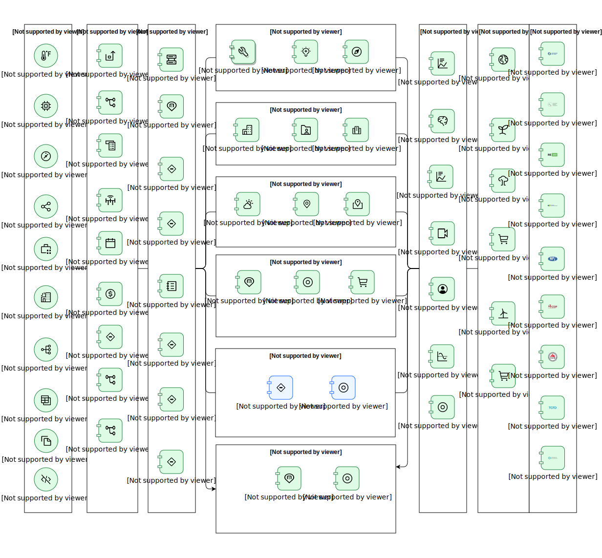

---
tags:
    - AOD-Ent
---

#  Enterprise View SRA 2.0

### Description

A comprehensive framework that outlines best practices, guidelines, and principles for designing and implementing sustainable IT and business processes, fostering environmental and social responsibility within an organization.

## Element(s)

### Actor(s)

| Name | Description | Type | GenericGroup |
| --- | --- | --- | --- |
| Asset | 
Asset can include machinery, equipment, buildings, vehicles, and other infrastructure that are necessary for the operation of a business or organization.
 | IT System | 
<strong>SubSystem,Physical</strong>[Auto-Generated]

This group is derived from SubSystem named Physical.
 |
| Controls | 
A control system uses sensors and actuators to monitor and control the operation of a system or process. Control systems can be used to automatically adjust the operation of a system based on predetermined setpoints, as well as to respond to changes in the environment or to commands from operators.
 | IT System | 
<strong>SubSystem,Physical</strong>[Auto-Generated]

This group is derived from SubSystem named Physical.
 |
| Files | 
Data files that are shared for the regular business to run with external parties e.g. Trading Partners, Regulatory &amp; Compliance Boards etc.
 | IT System | 
<strong>SubSystem,Physical</strong>[Auto-Generated]

This group is derived from SubSystem named Physical.
 |
| IoT | 
The Internet of Things (IoT) is a system of interconnected devices, machines, and systems communicating and exchanging data over a network without requiring human intervention. These devices may be connected through various technologies, including wireless, wired, and Bluetooth, and they can be used to gather and transmit data for various purposes, including energy management, building automation, and asset tracking.
 | IT System | 
<strong>SubSystem,Physical</strong>[Auto-Generated]

This group is derived from SubSystem named Physical.
 |
| Lease System | 
A lease system is a method of acquiring the use of an asset or property for a specific period in exchange for periodic payments, called rentals or leases.
 | IT System | 
<strong>SubSystem,Physical</strong>[Auto-Generated]

This group is derived from SubSystem named Physical.
 |
| Metering System | 
The metering system is a system of meters that provides data on energy use, energy demand, or other performance characteristics of a building system, subsystem, or equipment. Building Management
 | IT System | 
<strong>SubSystem,Physical</strong>[Auto-Generated]

This group is derived from SubSystem named Physical.
 |
| Network Equipment | 
Network equipment refers to the hardware and software that is used to connect devices and systems to a network, such as a local area network (LAN) or a wide area network (WAN). Network equipment includes devices such as routers, switches, hubs, and modems, as well as cables and other connectivity devices.
 | IT System | 
<strong>SubSystem,Physical</strong>[Auto-Generated]

This group is derived from SubSystem named Physical.
 |
| Sensors | 
A sensor is a device that provides a usable output in response to a specified physical input. Sensors are often used to detect and measure environmental parameters such as temperature, humidity, air quality, and occupancy.
 | IT System | 
<strong>SubSystem,Physical</strong>[Auto-Generated]

This group is derived from SubSystem named Physical.
 |
| Source code | 
Source code is the human-readable set of instructions written in a programming language that serves as the input for software development, defining the application's functionality and logic in a reference architecture diagram.
 | IT System | 
<strong>SubSystem,Physical</strong>[Auto-Generated]

This group is derived from SubSystem named Physical.
 |
| Spreadsheets | 
A physical layer spreadsheet contains transactional and interval data of asset assets in the facility.
 | IT System | 
<strong>SubSystem,Physical</strong>[Auto-Generated]

This group is derived from SubSystem named Physical.
 |

### Subsystem(s)

| Name | Description | Sub-Diagram |
| --- | --- | --- |
| Asset Management | The asset management layer allows customers to enable sustainability centric planning, operation, and management of their complex physical assets.&nbsp;  |  |
| Climate Risk | The climate risk layer allows customers to identify, track, manage and mitigate climate-based risks [for example - temperature, humidity, precipitation, frost etc.] |  |
| Facility Management | The facility management layer allows customers to enable sustainability-centric facilities management through various facility life cycle [acquire, build, manage, utilize, maintain and dispose of]. |  |
| Integration | The integration layer is the first stage in consuming information from the physical layer and will provide the interface to data and/or functionality of one or more sustainability applications.&nbsp;  |  |
| Physical | The physical layer is the foundation system of the Sustainability architecture where the data gets generated and stored.&nbsp;  |  |
| Supply Chain Circularity | The Supply Chain Circularity Layer allows customers to minimize the costs and amount of carbon emissions generated by supply chain activities   |  |
| AI & Analytics | The AI &amp; Analytics layer allows customers to sift through their sustainability application data points and extract valuable insights.  |  |
| Data Mapping and Storage | The data layer will help to store, standardize and normalize data in a meaningful[example - relationship between data] way that sustainability applications can consume.&nbsp;  |  |
| ESG Framework | The ESG Reporting Framework lets customers establish goals, and report on those goals to meet regulatory requirements including auditability.  Also, it allows customers to get insights into where organizations can make changes to improve their sustainability posture.   |  |
| ESG Reporting | The ESG platform layer allows customers to get deep visibility into environmental, human, and governance risks.  |  |
| Green IT | 
Green IT focuses on optimizing technology infrastructure and operations to reduce energy consumption, minimize waste, and lower carbon emissions.
 |  |
| Sustainable Design | 
Sustainable design integrates environmental considerations into every phase of the product lifecycle, optimizing resource efficiency, minimizing environmental impact, and ensuring long-term sustainability in product development and operations.
 |  |

### Logical Component(s)

Accelerate Decarbonization

<table>
    <caption></caption>
    <tr>
        <td> <strong>Name</strong> </td>
        <td>Accelerate Decarbonization</td>
    </tr>
    <tr>
        <td> <strong>Description</strong> </td>
        <td>
Accelerate decarbonization refers to the process of increasing the speed and scale at which carbon dioxide (CO2) and other greenhouse gases are reduced or eliminated in order to mitigate the impacts of climate change.
</td>
    </tr>
    <tr>
        <td> <strong>Functional Requirement</strong> </td>
        <td>
ESG 1 - ESG Goal setting and tracking
</td>
    </tr>
</table>

    

Advancing Net Zero

<table>
    <caption></caption>
    <tr>
        <td> <strong>Name</strong> </td>
        <td>Advancing Net Zero</td>
    </tr>
    <tr>
        <td> <strong>Description</strong> </td>
        <td>
Advancing Net Zero is WorldGBC's global program working towards total sector decarbonization by 2050
</td>
    </tr>
    <tr>
        <td> <strong>Functional Requirement</strong> </td>
        <td>
ESG 1 - ESG Goal setting and tracking
</td>
    </tr>
</table>

    

AI Assistant

<table>
    <caption></caption>
    <tr>
        <td> <strong>Name</strong> </td>
        <td>AI Assistant</td>
    </tr>
    <tr>
        <td> <strong>Description</strong> </td>
        <td>
An AI assistant is a software application or system that is designed to perform tasks and provide assistance to users using artificial intelligence (AI) technologies, such as natural language processing (NLP) and machine learning.
</td>
    </tr>
    <tr>
        <td> <strong>Primary Capability</strong> </td>
        <td>
conversational ai
</td>
    </tr>
</table>

    

AI Broker

<table>
    <caption></caption>
    <tr>
        <td> <strong>Name</strong> </td>
        <td>AI Broker</td>
    </tr>
    <tr>
        <td> <strong>Description</strong> </td>
        <td>
The AI broker is the integration hub that facilitates communication between Application and IBM watsonx AI systems or services.
</td>
    </tr>
</table>

    

Canonical Model

<table>
    <caption></caption>
    <tr>
        <td> <strong>Name</strong> </td>
        <td>Canonical Model</td>
    </tr>
    <tr>
        <td> <strong>Description</strong> </td>
        <td>
Canonical Data Models are a type of data model that aim to present data entities and relationships in the simplest possible form to integrate processes across various systems.
</td>
    </tr>
</table>

    

CDP

<table>
    <caption></caption>
    <tr>
        <td> <strong>Name</strong> </td>
        <td>CDP</td>
    </tr>
    <tr>
        <td> <strong>Description</strong> </td>
        <td>
CDP is a not-for-profit charity that runs the global disclosure system for investors, companies, cities, states and regions to manage their environmental impacts.
</td>
    </tr>
</table>

    

Circular Economy & Reverse Logistics

<table>
    <caption></caption>
    <tr>
        <td> <strong>Name</strong> </td>
        <td>Circular Economy & Reverse Logistics</td>
    </tr>
    <tr>
        <td> <strong>Description</strong> </td>
        <td>
Circular economy is an economic model in which resources are conserved and waste is minimized through the reuse and recycling of materials and products. Reverse logistics is a set of processes and activities related to the management of the return or reuse of products, materials, and resources.
</td>
    </tr>
    <tr>
        <td> <strong>Primary Capability</strong> </td>
        <td>
application
</td>
    </tr>
    <tr>
        <td> <strong>Implementation</strong> </td>
        <td>
Supply Chain Intelligence Suite (SaaS)
</td>
    </tr>
</table>

    

Climate Risk Map

<table>
    <caption></caption>
    <tr>
        <td> <strong>Name</strong> </td>
        <td>Climate Risk Map</td>
    </tr>
    <tr>
        <td> <strong>Description</strong> </td>
        <td>
A climate risk map is a visual representation of the potential risks and impacts of climate change on a particular region or area.
</td>
    </tr>
    <tr>
        <td> <strong>Primary Capability</strong> </td>
        <td>
application
</td>
    </tr>
    <tr>
        <td> <strong>Functional Requirement</strong> </td>
        <td>
CR 1 - Climate risk mitigation recommendation with actionable insight

ESG 1 - ESG Goal setting and tracking
</td>
    </tr>
    <tr>
        <td> <strong>Implementation</strong> </td>
        <td>
Environmental Intelligence Suite (EIS)
</td>
    </tr>
</table>

    

Computer Vision

<table>
    <caption></caption>
    <tr>
        <td> <strong>Name</strong> </td>
        <td>Computer Vision</td>
    </tr>
    <tr>
        <td> <strong>Description</strong> </td>
        <td>
Computer vision is a field of artificial intelligence (AI) that involves the development of algorithms and systems that can interpret and understand visual data, such as images and videos.
</td>
    </tr>
</table>

    

Connector

<table>
    <caption></caption>
    <tr>
        <td> <strong>Name</strong> </td>
        <td>Connector</td>
    </tr>
    <tr>
        <td> <strong>Description</strong> </td>
        <td>
Connector refers to a device or software that allows different devices or systems to communicate and exchange data with each other. Connectors enable the interoperability of different devices and systems, allowing them to work together and share data over a network.
</td>
    </tr>
    <tr>
        <td> <strong>Functional Requirement</strong> </td>
        <td>
AM 1 - Asset operations anomaly detection with actionable insight

CR 1 - Climate risk mitigation recommendation with actionable insight

ESG 1 - ESG Goal setting and tracking

FM 1 - Facility Space operations anomaly detection with actionable insight

IT 1 - IT operations anomaly detection with actionable insight

SM 1 - Tracking supplier sustainability performance and promoting sustainable sourcing
</td>
    </tr>
</table>

    

Data Model

<table>
    <caption></caption>
    <tr>
        <td> <strong>Name</strong> </td>
        <td>Data Model</td>
    </tr>
    <tr>
        <td> <strong>Description</strong> </td>
        <td>
A data model is a way of organizing and representing data in a computer system. It defines the structure and relationships between different data pieces and serves as a blueprint for how the data will be stored and accessed.
</td>
    </tr>
    <tr>
        <td> <strong>Functional Requirement</strong> </td>
        <td>
AM 1 - Asset operations anomaly detection with actionable insight

ESG 1 - ESG Goal setting and tracking

IT 1 - IT operations anomaly detection with actionable insight

SM 1 - Tracking supplier sustainability performance and promoting sustainable sourcing
</td>
    </tr>
</table>

    

Dow Jones Sustainability Index

<table>
    <caption></caption>
    <tr>
        <td> <strong>Name</strong> </td>
        <td>Dow Jones Sustainability Index</td>
    </tr>
    <tr>
        <td> <strong>Description</strong> </td>
        <td>
The Dow Jones Sustainability Index was a stock index focused on European companies with high environmental, social, and governance (ESG) scores.
</td>
    </tr>
</table>

    

Edge

<table>
    <caption></caption>
    <tr>
        <td> <strong>Name</strong> </td>
        <td>Edge</td>
    </tr>
    <tr>
        <td> <strong>Description</strong> </td>
        <td>
The &quot;edge devices&quot; are responsible for collecting, processing, and transmitting data from the assets being monitored, often in real-time.
</td>
    </tr>
</table>

    

EDI

<table>
    <caption></caption>
    <tr>
        <td> <strong>Name</strong> </td>
        <td>EDI</td>
    </tr>
    <tr>
        <td> <strong>Description</strong> </td>
        <td>
Electronic Data Exchange (EDI) enables secure, automated transfer of standardized data between systems, streamlining communication and integration across organizations.
</td>
    </tr>
</table>

    

Efficiency Finder

<table>
    <caption></caption>
    <tr>
        <td> <strong>Name</strong> </td>
        <td>Efficiency Finder</td>
    </tr>
    <tr>
        <td> <strong>Description</strong> </td>
        <td>
Application to identify and analyze the efficiency of assets within an asset management system. This may include identifying opportunities for improving the performance or efficiency of the asset, as well as identifying potential problems or inefficiencies that could impact its performance.
</td>
    </tr>
    <tr>
        <td> <strong>Primary Capability</strong> </td>
        <td>
application
</td>
    </tr>
    <tr>
        <td> <strong>Functional Requirement</strong> </td>
        <td>
ESG 1 - ESG Goal setting and tracking

FM 1 - Facility Space operations anomaly detection with actionable insight
</td>
    </tr>
    <tr>
        <td> <strong>Implementation</strong> </td>
        <td>
Maximo Application Suite - Monitor

Maximo Application Suite
</td>
    </tr>
</table>

    

Environmental Data

<table>
    <caption></caption>
    <tr>
        <td> <strong>Name</strong> </td>
        <td>Environmental Data</td>
    </tr>
    <tr>
        <td> <strong>Description</strong> </td>
        <td>
Environmental data refers to information that is collected about the natural environment and its various components, such as air, water, soil, plants, etc. This data can be collected using various methods, including field observations, remote sensing, and laboratory analysis, and it can be used to understand and monitor the health and functioning of the environment.
</td>
    </tr>
    <tr>
        <td> <strong>Primary Capability</strong> </td>
        <td>
data
</td>
    </tr>
    <tr>
        <td> <strong>Functional Requirement</strong> </td>
        <td>
CR 1 - Climate risk mitigation recommendation with actionable insight

ESG 1 - ESG Goal setting and tracking

FM 1 - Facility Space operations anomaly detection with actionable insight
</td>
    </tr>
    <tr>
        <td> <strong>Implementation</strong> </td>
        <td>
Environmental Intelligence Suite (EIS)
</td>
    </tr>
</table>

    

ERP

<table>
    <caption></caption>
    <tr>
        <td> <strong>Name</strong> </td>
        <td>ERP</td>
    </tr>
    <tr>
        <td> <strong>Description</strong> </td>
        <td>
Enterprise resource planning (ERP) systems are software platforms that are designed to help organizations manage and integrate their business processes, such as finance, accounting, human resources, procurement, and supply chain management.
</td>
    </tr>
    <tr>
        <td> <strong>Primary Capability</strong> </td>
        <td>
application
</td>
    </tr>
    <tr>
        <td> <strong>Functional Requirement</strong> </td>
        <td>
ESG 1 - ESG Goal setting and tracking

FM 1 - Facility Space operations anomaly detection with actionable insight
</td>
    </tr>
</table>

    

ESG Reporting Frameworks

<table>
    <caption></caption>
    <tr>
        <td> <strong>Name</strong> </td>
        <td>ESG Reporting Frameworks</td>
    </tr>
    <tr>
        <td> <strong>Description</strong> </td>
        <td>
ESG (environmental, social, and governance) reporting frameworks are guidelines or standards that organizations can use to report on their environmental, social, and governance performance, risks, and impacts.
</td>
    </tr>
    <tr>
        <td> <strong>Primary Capability</strong> </td>
        <td>
application
</td>
    </tr>
    <tr>
        <td> <strong>Functional Requirement</strong> </td>
        <td>
CR 1 - Climate risk mitigation recommendation with actionable insight

ESG 1 - ESG Goal setting and tracking

FM 1 - Facility Space operations anomaly detection with actionable insight

SM 1 - Tracking supplier sustainability performance and promoting sustainable sourcing
</td>
    </tr>
    <tr>
        <td> <strong>Implementation</strong> </td>
        <td>
enVizi (SaaS)
</td>
    </tr>
</table>

    

External Events

<table>
    <caption></caption>
    <tr>
        <td> <strong>Name</strong> </td>
        <td>External Events</td>
    </tr>
    <tr>
        <td> <strong>Description</strong> </td>
        <td>
External events refer to changes in the environment or external conditions that can impact the operation of systems. External events can include a wide range of factors, such as temperature, humidity, air quality, or other physical conditions; certain substances or materials; or the presence or movement of people or objects.
</td>
    </tr>
</table>

    

Financials

<table>
    <caption></caption>
    <tr>
        <td> <strong>Name</strong> </td>
        <td>Financials</td>
    </tr>
    <tr>
        <td> <strong>Description</strong> </td>
        <td>
Financial include various metrics, such as revenue, profits, expenses, cash flow, assets, liabilities, and equity.
</td>
    </tr>
    <tr>
        <td> <strong>Functional Requirement</strong> </td>
        <td>
ESG 1 - ESG Goal setting and tracking

SM 1 - Tracking supplier sustainability performance and promoting sustainable sourcing
</td>
    </tr>
</table>

    

Geospatial Analytics

<table>
    <caption></caption>
    <tr>
        <td> <strong>Name</strong> </td>
        <td>Geospatial Analytics</td>
    </tr>
    <tr>
        <td> <strong>Description</strong> </td>
        <td>
Geospatial analytics is the analysis of spatial data to understand and visualize patterns, trends, and relationships in a geographic context.
</td>
    </tr>
    <tr>
        <td> <strong>Primary Capability</strong> </td>
        <td>
analytics
</td>
    </tr>
    <tr>
        <td> <strong>Functional Requirement</strong> </td>
        <td>
CR 1 - Climate risk mitigation recommendation with actionable insight
</td>
    </tr>
    <tr>
        <td> <strong>Implementation</strong> </td>
        <td>
Environmental Intelligence Suite (EIS)
</td>
    </tr>
</table>

    

GHG Protocol

<table>
    <caption></caption>
    <tr>
        <td> <strong>Name</strong> </td>
        <td>GHG Protocol</td>
    </tr>
    <tr>
        <td> <strong>Description</strong> </td>
        <td>
GHG Protocol establishes comprehensive global standardized frameworks to measure and manage greenhouse gas (GHG) emissions from private and public sector operations, value chains and mitigation actions.
</td>
    </tr>
    <tr>
        <td> <strong>Functional Requirement</strong> </td>
        <td>
AM 1 - Asset operations anomaly detection with actionable insight

CR 1 - Climate risk mitigation recommendation with actionable insight

ESG 1 - ESG Goal setting and tracking

FM 1 - Facility Space operations anomaly detection with actionable insight

IT 1 - IT operations anomaly detection with actionable insight
</td>
    </tr>
</table>

    

Green Computing

<table>
    <caption></caption>
    <tr>
        <td> <strong>Name</strong> </td>
        <td>Green Computing</td>
    </tr>
    <tr>
        <td> <strong>Description</strong> </td>
        <td>
Designing and implementing computer systems and applications that are environmentally sustainable and minimize their impact on the planet.
</td>
    </tr>
    <tr>
        <td> <strong>Primary Capability</strong> </td>
        <td>
application
</td>
    </tr>
    <tr>
        <td> <strong>Implementation</strong> </td>
        <td>
Copy of Supply Chain Intelligence Suite (SaaS)_2
</td>
    </tr>
</table>

    

Green Data Exchange

<table>
    <caption></caption>
    <tr>
        <td> <strong>Name</strong> </td>
        <td>Green Data Exchange</td>
    </tr>
    <tr>
        <td> <strong>Description</strong> </td>
        <td>
Green data Exchange is to enable information supply chains to reduce carbon footprints and risks while building brand equity and top line growth i.e. leverage EDI/API to enable the world to track carbon emission and consumption and communicate and collaborate directly with partners to share sustainability compliance information.
</td>
    </tr>
    <tr>
        <td> <strong>Primary Capability</strong> </td>
        <td>
management
</td>
    </tr>
    <tr>
        <td> <strong>Implementation</strong> </td>
        <td>
Copy of Turbonomic
</td>
    </tr>
</table>

    

Green Leases

<table>
    <caption></caption>
    <tr>
        <td> <strong>Name</strong> </td>
        <td>Green Leases</td>
    </tr>
    <tr>
        <td> <strong>Description</strong> </td>
        <td>
Green leases are leases for commercial or residential properties that include provisions related to environmental sustainability and energy efficiency. These provisions may require the tenant or property owner to take certain actions to reduce their environmental impact, such as using energy-efficient appliances or implementing water conservation measures.
</td>
    </tr>
    <tr>
        <td> <strong>Primary Capability</strong> </td>
        <td>
application
</td>
    </tr>
    <tr>
        <td> <strong>Functional Requirement</strong> </td>
        <td>
ESG 1 - ESG Goal setting and tracking
</td>
    </tr>
    <tr>
        <td> <strong>Implementation</strong> </td>
        <td>
TRIRIGA application suite

TRIRIGA Application Suite - Managed Services

TRIRIGA Application Suite - Lease
</td>
    </tr>
</table>

    

Intelligent Maintenance

<table>
    <caption></caption>
    <tr>
        <td> <strong>Name</strong> </td>
        <td>Intelligent Maintenance</td>
    </tr>
    <tr>
        <td> <strong>Description</strong> </td>
        <td>
Application for managing and maintaining assets that use data and analytics to predict when maintenance is needed. This approach is designed to optimize the maintenance schedule for an asset based on its actual condition, rather than following a predetermined schedule or reacting to failures.
</td>
    </tr>
    <tr>
        <td> <strong>Functional Requirement</strong> </td>
        <td>
AM 1 - Asset operations anomaly detection with actionable insight

ESG 1 - ESG Goal setting and tracking
</td>
    </tr>
    <tr>
        <td> <strong>Implementation</strong> </td>
        <td>
Maximo Application Suite - Managed Services
</td>
    </tr>
</table>

    

IT Optimization Service

<table>
    <caption></caption>
    <tr>
        <td> <strong>Name</strong> </td>
        <td>IT Optimization Service</td>
    </tr>
    <tr>
        <td> <strong>Description</strong> </td>
        <td>
Maximize the efficiency and sustainability of an organization's I.T. infrastructure and operations.
</td>
    </tr>
</table>

    

Large Language Model

<table>
    <caption></caption>
    <tr>
        <td> <strong>Name</strong> </td>
        <td>Large Language Model</td>
    </tr>
    <tr>
        <td> <strong>Description</strong> </td>
        <td>
Prediction refers to the process of using data and algorithms to identify patterns and trends and to make forecasts or predictions about future outcomes.
</td>
    </tr>
</table>

    

Locations

<table>
    <caption></caption>
    <tr>
        <td> <strong>Name</strong> </td>
        <td>Locations</td>
    </tr>
    <tr>
        <td> <strong>Description</strong> </td>
        <td>
Location refers to the physical location of devices, sensors, and other assets connected to the network.
</td>
    </tr>
    <tr>
        <td> <strong>Functional Requirement</strong> </td>
        <td>
ESG 1 - ESG Goal setting and tracking
</td>
    </tr>
</table>

    

Machine Learning

<table>
    <caption></caption>
    <tr>
        <td> <strong>Name</strong> </td>
        <td>Machine Learning</td>
    </tr>
    <tr>
        <td> <strong>Description</strong> </td>
        <td>
Machine learning is a subfield of artificial intelligence (AI) that involves the development of algorithms and models that can learn from and make predictions or decisions based on data.
</td>
    </tr>
    <tr>
        <td> <strong>Primary Capability</strong> </td>
        <td>
machine learning
</td>
    </tr>
    <tr>
        <td> <strong>Functional Requirement</strong> </td>
        <td>
IT 1 - IT operations anomaly detection with actionable insight
</td>
    </tr>
</table>

    

Model Catalog

<table>
    <caption></caption>
    <tr>
        <td> <strong>Name</strong> </td>
        <td>Model Catalog</td>
    </tr>
    <tr>
        <td> <strong>Description</strong> </td>
        <td>
The model catalog is a collection of models that are used to represent and analyze different aspects of the system. A model is a simplified representation of a system or process that helps to understand and analyze it.
</td>
    </tr>
</table>

    

NPi

<table>
    <caption></caption>
    <tr>
        <td> <strong>Name</strong> </td>
        <td>NPi</td>
    </tr>
    <tr>
        <td> <strong>Description</strong> </td>
        <td>
The Australian National Pollutant Inventory (NPI) is a database maintained by the Australian government that provides information on emissions and pollutants released into the air, water, and land by industrial facilities across Australia.
</td>
    </tr>
</table>

    

Partner Scorecard (Data Exchange)

<table>
    <caption></caption>
    <tr>
        <td> <strong>Name</strong> </td>
        <td>Partner Scorecard (Data Exchange)</td>
    </tr>
    <tr>
        <td> <strong>Description</strong> </td>
        <td>
Partner Scorecard is determined by screening the Trading Partners based on doing business with them i.e. usage patterns (protocols, reprocessing etc..), select ESG criteria e.g. companies decarbonizing at a faster pace or investments in companies with low emission asset and Integrating with external sources to get the partner rating for ESG
</td>
    </tr>
    <tr>
        <td> <strong>Primary Capability</strong> </td>
        <td>
application
</td>
    </tr>
    <tr>
        <td> <strong>Implementation</strong> </td>
        <td>
Copy of IBM z16

Copy of IBM Cloud
</td>
    </tr>
</table>

    

Pattern Detection

<table>
    <caption></caption>
    <tr>
        <td> <strong>Name</strong> </td>
        <td>Pattern Detection</td>
    </tr>
    <tr>
        <td> <strong>Description</strong> </td>
        <td>
Pattern detection rules are a set of guidelines or criteria that are used to identify and classify patterns in data. Example - Anomaly detection
</td>
    </tr>
    <tr>
        <td> <strong>Functional Requirement</strong> </td>
        <td>
AM 1 - Asset operations anomaly detection with actionable insight

CR 1 - Climate risk mitigation recommendation with actionable insight

FM 1 - Facility Space operations anomaly detection with actionable insight
</td>
    </tr>
</table>

    

Prediction

<table>
    <caption></caption>
    <tr>
        <td> <strong>Name</strong> </td>
        <td>Prediction</td>
    </tr>
    <tr>
        <td> <strong>Description</strong> </td>
        <td>
Prediction refers to the process of using data and algorithms to identify patterns and trends and to make forecasts or predictions about future outcomes.
</td>
    </tr>
</table>

    

Processing Rules

<table>
    <caption></caption>
    <tr>
        <td> <strong>Name</strong> </td>
        <td>Processing Rules</td>
    </tr>
    <tr>
        <td> <strong>Description</strong> </td>
        <td>
Processing rules in data systems refer to the set of instructions or algorithms that are used to manipulate and process data within the system. These rules can be used to perform a wide range of tasks, including data validation, transformation, aggregation, and analysis.
</td>
    </tr>
    <tr>
        <td> <strong>Functional Requirement</strong> </td>
        <td>
CR 1 - Climate risk mitigation recommendation with actionable insight

ESG 1 - ESG Goal setting and tracking

FM 1 - Facility Space operations anomaly detection with actionable insight
</td>
    </tr>
</table>

    

Protocol Adapters

<table>
    <caption></caption>
    <tr>
        <td> <strong>Name</strong> </td>
        <td>Protocol Adapters</td>
    </tr>
    <tr>
        <td> <strong>Description</strong> </td>
        <td>
A protocol adapter is a tool connecting two different types of data so that they can work together as you want.
</td>
    </tr>
</table>

    

RE 100

<table>
    <caption></caption>
    <tr>
        <td> <strong>Name</strong> </td>
        <td>RE 100</td>
    </tr>
    <tr>
        <td> <strong>Description</strong> </td>
        <td>
RE100 is the global corporate renewable energy initiative bringing together hundreds of large and ambitious businesses committed to 100% renewable electricity.
</td>
    </tr>
</table>

    

REST API

<table>
    <caption></caption>
    <tr>
        <td> <strong>Name</strong> </td>
        <td>REST API</td>
    </tr>
    <tr>
        <td> <strong>Description</strong> </td>
        <td>
REST API (short for Representational State Transfer Application Programming Interface) is a type of API that allows software applications to communicate with each other over the internet. REST APIs use a standard set of protocols and data formats to exchange information between applications, allowing them to communicate and share data in a consistent and predictable manner.
</td>
    </tr>
    <tr>
        <td> <strong>Functional Requirement</strong> </td>
        <td>
AM 1 - Asset operations anomaly detection with actionable insight

CR 1 - Climate risk mitigation recommendation with actionable insight

ESG 1 - ESG Goal setting and tracking
</td>
    </tr>
</table>

    

SASB

<table>
    <caption></caption>
    <tr>
        <td> <strong>Name</strong> </td>
        <td>SASB</td>
    </tr>
    <tr>
        <td> <strong>Description</strong> </td>
        <td>
SASB Standards guide the disclosure of financially material sustainability information by companies to their investors.
</td>
    </tr>
    <tr>
        <td> <strong>Functional Requirement</strong> </td>
        <td>
ESG 1 - ESG Goal setting and tracking
</td>
    </tr>
</table>

    

Science Based Targets

<table>
    <caption></caption>
    <tr>
        <td> <strong>Name</strong> </td>
        <td>Science Based Targets</td>
    </tr>
    <tr>
        <td> <strong>Description</strong> </td>
        <td>
The Science Based Targets initiative is a collaboration between the CDP, the United Nations Global Compact, World Resources Institute and the World Wide Fund for Nature. Since 2015 more than 1,000 companies have joined the initiative to set a science-based climate target
</td>
    </tr>
    <tr>
        <td> <strong>Functional Requirement</strong> </td>
        <td>
ESG 1 - ESG Goal setting and tracking
</td>
    </tr>
</table>

    

Scope 1, 2 GHG Accounting + Reporting

<table>
    <caption></caption>
    <tr>
        <td> <strong>Name</strong> </td>
        <td>Scope 1, 2 GHG Accounting + Reporting</td>
    </tr>
    <tr>
        <td> <strong>Description</strong> </td>
        <td>
Scope 1, 2, and 3 GHG (greenhouse gas) emissions are categories used to classify and report the greenhouse gas emissions of an organization. Scope 1 emissions are direct emissions that are under the control of an organization, such as emissions from company-owned vehicles or equipment. Scope 2 emissions are indirect emissions that result from an organization's consumption of purchased electricity, steam, heating, or cooling.
</td>
    </tr>
    <tr>
        <td> <strong>Functional Requirement</strong> </td>
        <td>
AM 1 - Asset operations anomaly detection with actionable insight

CR 1 - Climate risk mitigation recommendation with actionable insight

ESG 1 - ESG Goal setting and tracking

FM 1 - Facility Space operations anomaly detection with actionable insight
</td>
    </tr>
</table>

    

Scope 3 GHG Accounting + Reporting

<table>
    <caption></caption>
    <tr>
        <td> <strong>Name</strong> </td>
        <td>Scope 3 GHG Accounting + Reporting</td>
    </tr>
    <tr>
        <td> <strong>Description</strong> </td>
        <td>
Scope 3 GHG (greenhouse gas) accounting and reporting refers to the measurement, accounting, and reporting of greenhouse gas emissions from sources that are not directly owned or controlled by an organization, but that are related to its activities.
</td>
    </tr>
    <tr>
        <td> <strong>Functional Requirement</strong> </td>
        <td>
ESG 1 - ESG Goal setting and tracking

SM 1 - Tracking supplier sustainability performance and promoting sustainable sourcing
</td>
    </tr>
</table>

    

Scope 3 GHG Reporting & Performance

<table>
    <caption></caption>
    <tr>
        <td> <strong>Name</strong> </td>
        <td>Scope 3 GHG Reporting & Performance</td>
    </tr>
    <tr>
        <td> <strong>Description</strong> </td>
        <td>
Scope 3 GHG (greenhouse gas) reporting and performance refers to the measurement, reporting, and management of greenhouse gas emissions from sources that are not directly owned or controlled by an organization, but that are related to its activities.
</td>
    </tr>
    <tr>
        <td> <strong>Primary Capability</strong> </td>
        <td>
application
</td>
    </tr>
    <tr>
        <td> <strong>Functional Requirement</strong> </td>
        <td>
ESG 1 - ESG Goal setting and tracking

SM 1 - Tracking supplier sustainability performance and promoting sustainable sourcing
</td>
    </tr>
    <tr>
        <td> <strong>Implementation</strong> </td>
        <td>
Supply Chain Intelligence Suite (SaaS)
</td>
    </tr>
</table>

    

Scope 3 GHG Reporting & Performance - External Data Exchange

<table>
    <caption></caption>
    <tr>
        <td> <strong>Name</strong> </td>
        <td>Scope 3 GHG Reporting & Performance - External Data Exchange</td>
    </tr>
    <tr>
        <td> <strong>Description</strong> </td>
        <td>
Scope 3 GHG (greenhouse gas) accounting and reporting refers to the measurement, accounting, and reporting of greenhouse gas emissions from external sources i.e. trading partners.
</td>
    </tr>
    <tr>
        <td> <strong>Primary Capability</strong> </td>
        <td>
application
</td>
    </tr>
    <tr>
        <td> <strong>Implementation</strong> </td>
        <td>
Copy of Supply Chain Intelligence Suite (SaaS)
</td>
    </tr>
</table>

    

Storage

<table>
    <caption></caption>
    <tr>
        <td> <strong>Name</strong> </td>
        <td>Storage</td>
    </tr>
    <tr>
        <td> <strong>Description</strong> </td>
        <td>
Storage refers to the physical or virtual space where data is saved and stored for later use. Storage is an essential part of any data system, enabling it to retain and access data over time.
</td>
    </tr>
    <tr>
        <td> <strong>Functional Requirement</strong> </td>
        <td>
AM 1 - Asset operations anomaly detection with actionable insight

ESG 1 - ESG Goal setting and tracking

IT 1 - IT operations anomaly detection with actionable insight
</td>
    </tr>
</table>

    

Sustainability Program Tracking

<table>
    <caption></caption>
    <tr>
        <td> <strong>Name</strong> </td>
        <td>Sustainability Program Tracking</td>
    </tr>
    <tr>
        <td> <strong>Description</strong> </td>
        <td>
Sustainability program tracking is the process of monitoring and measuring the progress and performance of a sustainability program or initiative.
</td>
    </tr>
    <tr>
        <td> <strong>Functional Requirement</strong> </td>
        <td>
ESG 1 - ESG Goal setting and tracking

FM 1 - Facility Space operations anomaly detection with actionable insight
</td>
    </tr>
</table>

    

Sustainable Health

<table>
    <caption></caption>
    <tr>
        <td> <strong>Name</strong> </td>
        <td>Sustainable Health</td>
    </tr>
    <tr>
        <td> <strong>Description</strong> </td>
        <td>
It is the ability of an asset to operate effectively and efficiently over a long period of time without incurring excessive costs or causing negative impacts on the environment.
</td>
    </tr>
    <tr>
        <td> <strong>Primary Capability</strong> </td>
        <td>
application
</td>
    </tr>
    <tr>
        <td> <strong>Implementation</strong> </td>
        <td>
Maximo Application Suite - Managed Services

Maximo Application Suite - Health

Maximo Application Suite
</td>
    </tr>
</table>

    

Sustainable Product Compliance

<table>
    <caption></caption>
    <tr>
        <td> <strong>Name</strong> </td>
        <td>Sustainable Product Compliance</td>
    </tr>
    <tr>
        <td> <strong>Description</strong> </td>
        <td>
Sustainable Product Compliance to regulations
</td>
    </tr>
    <tr>
        <td> <strong>Primary Capability</strong> </td>
        <td>
application
</td>
    </tr>
    <tr>
        <td> <strong>Implementation</strong> </td>
        <td>
Copy of Copy of IBM z16

Copy of Copy of IBM Cloud
</td>
    </tr>
</table>

    

Sustainable Product Design

<table>
    <caption></caption>
    <tr>
        <td> <strong>Name</strong> </td>
        <td>Sustainable Product Design</td>
    </tr>
    <tr>
        <td> <strong>Description</strong> </td>
        <td>
Design products to meet the customer sustainability goals and objectives
</td>
    </tr>
    <tr>
        <td> <strong>Primary Capability</strong> </td>
        <td>
management
</td>
    </tr>
    <tr>
        <td> <strong>Implementation</strong> </td>
        <td>
Copy of Copy of Turbonomic
</td>
    </tr>
</table>

    

Sustainable Projects

<table>
    <caption></caption>
    <tr>
        <td> <strong>Name</strong> </td>
        <td>Sustainable Projects</td>
    </tr>
    <tr>
        <td> <strong>Description</strong> </td>
        <td>
Sustainable projects aim to reduce environmental impacts, such as greenhouse gas emissions or resource consumption, or improve social and economic conditions by creating jobs or improving quality of life.
</td>
    </tr>
    <tr>
        <td> <strong>Primary Capability</strong> </td>
        <td>
application
</td>
    </tr>
    <tr>
        <td> <strong>Functional Requirement</strong> </td>
        <td>
ESG 1 - ESG Goal setting and tracking

FM 1 - Facility Space operations anomaly detection with actionable insight
</td>
    </tr>
    <tr>
        <td> <strong>Implementation</strong> </td>
        <td>
TRIRIGA application suite

TRIRIGA Application Suite - Projects
</td>
    </tr>
</table>

    

Sustainable Sourcing & Procurement

<table>
    <caption></caption>
    <tr>
        <td> <strong>Name</strong> </td>
        <td>Sustainable Sourcing & Procurement</td>
    </tr>
    <tr>
        <td> <strong>Description</strong> </td>
        <td>
Sustainable sourcing and procurement refers to the processes and practices used to acquire goods and services in a way that is environmentally, socially, and economically responsible and sustainable over the long term.
</td>
    </tr>
    <tr>
        <td> <strong>Primary Capability</strong> </td>
        <td>
application
</td>
    </tr>
    <tr>
        <td> <strong>Functional Requirement</strong> </td>
        <td>
ESG 1 - ESG Goal setting and tracking

SM 1 - Tracking supplier sustainability performance and promoting sustainable sourcing
</td>
    </tr>
    <tr>
        <td> <strong>Implementation</strong> </td>
        <td>
Supply Chain Intelligence Suite (SaaS)
</td>
    </tr>
</table>

    

Sustainable Space

<table>
    <caption></caption>
    <tr>
        <td> <strong>Name</strong> </td>
        <td>Sustainable Space</td>
    </tr>
    <tr>
        <td> <strong>Description</strong> </td>
        <td>
Sustainable space refers to physical spaces, such as buildings, neighborhoods, or communities, that are designed and operated in a way that is environmentally, socially, and economically responsible and sustainable over the long term.
</td>
    </tr>
    <tr>
        <td> <strong>Primary Capability</strong> </td>
        <td>
application
</td>
    </tr>
    <tr>
        <td> <strong>Functional Requirement</strong> </td>
        <td>
FM 1 - Facility Space operations anomaly detection with actionable insight
</td>
    </tr>
    <tr>
        <td> <strong>Implementation</strong> </td>
        <td>
TRIRIGA Application Suite - Projects

TRIRIGA application suite
</td>
    </tr>
</table>

    

TCFD

<table>
    <caption></caption>
    <tr>
        <td> <strong>Name</strong> </td>
        <td>TCFD</td>
    </tr>
    <tr>
        <td> <strong>Description</strong> </td>
        <td>
TCFD reporting refers to the practice of reporting on climate-related financial risks and opportunities in accordance with the recommendations of the Task Force on Climate-related Financial Disclosures (
</td>
    </tr>
    <tr>
        <td> <strong>Functional Requirement</strong> </td>
        <td>
ESG 1 - ESG Goal setting and tracking
</td>
    </tr>
</table>

    

Web forms

<table>
    <caption></caption>
    <tr>
        <td> <strong>Name</strong> </td>
        <td>Web forms</td>
    </tr>
    <tr>
        <td> <strong>Description</strong> </td>
        <td>
A web form is a user interface element on a website that allows users to input and submit data to the website.
</td>
    </tr>
    <tr>
        <td> <strong>Functional Requirement</strong> </td>
        <td>
SM 1 - Tracking supplier sustainability performance and promoting sustainable sourcing
</td>
    </tr>
</table>

    

### Logical Connector(s)

All connectors are not named.

    

