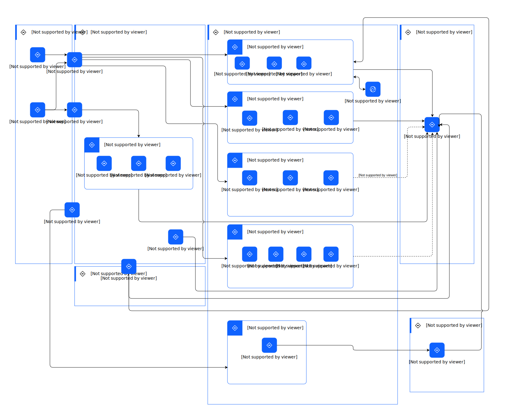

---
tags:
    - AOD-ITS
---

#  Deployment Overview - Current State

## Element(s)

### Location(s)

| Name | Description |
| --- | --- | 
 | AWS | 
Amazon Web Services (AWS) is a comprehensive cloud computing platform offering a wide range of services, including computing power, storage, and databases, enabling businesses to scale and innovate with flexible, on-demand resources.
 |
 | Client Network | 
The client network layer connects physical assets, ERP systems, and others, enabling secure data flow and communication between users, devices, and back end systems.
 |
 | Hybrid Cloud | 
It is a computing environment that combines on-premises infrastructure with public and private cloud services, enabling greater flexibility, scalability, and integration across multiple platforms while maintaining data security and compliance.
 |
 | IBM Cloud | 
IBM Cloud is a comprehensive cloud platform that offers a range of IaaS, PaaS, and SaaS solutions, enabling businesses to build, deploy, and manage applications securely across public, private, and hybrid cloud environments.
 |
 | IBM z16 | 
IBM Z16 is a high-performance mainframe designed to deliver advanced data privacy, AI-driven insights, and hybrid cloud capabilities, supporting mission-critical workloads with unparalleled security and scalability.
 |
 | Partner Cloud | 
Partner cloud refers to a cloud computing environment provided or managed by a third-party partner, enabling businesses to leverage specialized cloud services and solutions while integrating with their existing IT infrastructure.
 |

### Logical Connection(s)

| Name | Description |
| --- | --- | 
|[future state] |  |

There are other connections that have no names and descriptions.

    

### Logical Node(s)

    

Asset Management

<table>
    <caption></caption>
    <tr>
        <td> <strong>Name</strong> </td>
        <td>Asset Management</td>
    </tr>
    <tr>
        <td> <strong>Description</strong> </td>
        <td>
The asset management layer allows customers to enable sustainability centric planning, operation, and management of their complex physical assets.
</td>
    </tr>
    <tr>
        <td> <strong>Implementation</strong> </td>
        <td>
                
<a href="">Maximo Application Suite</a>

                
<a href="">Maximo Application Suite - Managed Services</a>
</td>
    </tr>
    <tr>
        <td> <strong>Related Diagrams</strong> </td>
        <td>
                
<a href="../../../../Architecture/Architecture-Overview/Usage-Scenario/Managing-an-Asset">Managing an Asset</a>

                
<a href="../../../../Architecture/Architecture-Overview/Usage-Scenario/Monitoring-an-Asset">Monitoring an Asset</a>

                
<a href="../../../../Architecture/Architecture-Overview/Usage-Scenario/Optimize-an-Asset-with-AI">Optimize an Asset with AI</a>

                
<a href="../../../../Architecture/Architecture-Overview/IT-System-View/Deployment-Overview---Current-State">Deployment Overview - Current State</a>
</td>
    </tr>
        <tr>
        <td> <strong>Related Elements</strong> </td>
        <td>
                
SYS_DU_3Urmyhd3Sdr

                
SYS_DU_3Us60cMrtoE

        </td>
    </tr>
</table>

    

Circular Economy & Reverse Logistics

<table>
    <caption></caption>
    <tr>
        <td> <strong>Name</strong> </td>
        <td>Circular Economy & Reverse Logistics</td>
    </tr>
    <tr>
        <td> <strong>Description</strong> </td>
        <td>
Circular economy is an economic model in which resources are conserved and waste is minimized through the reuse and recycling of materials and products. Reverse logistics is a set of processes and activities related to the management of the return or reuse of products, materials, and resources.
</td>
    </tr>
    <tr>
        <td> <strong>Primary Capability</strong> </td>
        <td>
                
application
</td>
    </tr>
    <tr>
        <td> <strong>Implementation</strong> </td>
        <td>
                
<a href="https://www.ibm.com/products/supply-chain-intelligence-suite">Supply Chain Intelligence Suite</a>
</td>
    </tr>
    <tr>
        <td> <strong>Related Diagrams</strong> </td>
        <td>
                
<a href="../../../../Architecture/Architecture-Overview/Usage-Scenario/Managing-an-Asset">Managing an Asset</a>

                
<a href="../../../../Architecture/Architecture-Overview/Usage-Scenario/Monitoring-an-Asset">Monitoring an Asset</a>

                
<a href="../../../../Architecture/Architecture-Overview/Usage-Scenario/Optimize-an-Asset-with-AI">Optimize an Asset with AI</a>

                
<a href="../../../../Architecture/Architecture-Overview/IT-System-View/Deployment-Overview---Current-State">Deployment Overview - Current State</a>
</td>
    </tr>
        <tr>
        <td> <strong>Related Elements</strong> </td>
        <td>
                
SYS_DU_3UFIVr2nbGa

        </td>
    </tr>
</table>

    

Climate Risk

<table>
    <caption></caption>
    <tr>
        <td> <strong>Name</strong> </td>
        <td>Climate Risk</td>
    </tr>
    <tr>
        <td> <strong>Description</strong> </td>
        <td>
The climate risk layer allows customers to identify, track, manage and mitigate climate-based risks [for example - temperature, humidity, precipitation, frost etc.]
</td>
    </tr>
    <tr>
        <td> <strong>Implementation</strong> </td>
        <td>
                
<a href="https://www.ibm.com/products/environmental-intelligence-suite">Environmental Intelligence Suite (EIS)</a>
</td>
    </tr>
    <tr>
        <td> <strong>Related Diagrams</strong> </td>
        <td>
                
<a href="../../../../Architecture/Architecture-Overview/Usage-Scenario/Managing-an-Asset">Managing an Asset</a>

                
<a href="../../../../Architecture/Architecture-Overview/Usage-Scenario/Monitoring-an-Asset">Monitoring an Asset</a>

                
<a href="../../../../Architecture/Architecture-Overview/Usage-Scenario/Optimize-an-Asset-with-AI">Optimize an Asset with AI</a>

                
<a href="../../../../Architecture/Architecture-Overview/IT-System-View/Deployment-Overview---Current-State">Deployment Overview - Current State</a>
</td>
    </tr>
        <tr>
        <td> <strong>Related Elements</strong> </td>
        <td>
                
SYS_DU_3UrYxldevRj

        </td>
    </tr>
</table>

    

Climate Risk Map

<table>
    <caption></caption>
    <tr>
        <td> <strong>Name</strong> </td>
        <td>Climate Risk Map</td>
    </tr>
    <tr>
        <td> <strong>Description</strong> </td>
        <td>
A climate risk map is a visual representation of the potential risks and impacts of climate change on a particular region or area.
</td>
    </tr>
    <tr>
        <td> <strong>Implementation</strong> </td>
        <td>
                
<a href="https://www.ibm.com/products/environmental-intelligence-suite">Environmental Intelligence Suite (EIS)</a>
</td>
    </tr>
    <tr>
        <td> <strong>Related Diagrams</strong> </td>
        <td>
                
<a href="../../../../Architecture/Architecture-Overview/Usage-Scenario/Managing-an-Asset">Managing an Asset</a>

                
<a href="../../../../Architecture/Architecture-Overview/Usage-Scenario/Monitoring-an-Asset">Monitoring an Asset</a>

                
<a href="../../../../Architecture/Architecture-Overview/Usage-Scenario/Optimize-an-Asset-with-AI">Optimize an Asset with AI</a>

                
<a href="../../../../Architecture/Architecture-Overview/IT-System-View/Deployment-Overview---Current-State">Deployment Overview - Current State</a>
</td>
    </tr>
        <tr>
        <td> <strong>Related Elements</strong> </td>
        <td>
                
SYS_DU_3V1cMBYI8HD

        </td>
    </tr>
</table>

    

Data Exchange

<table>
    <caption></caption>
    <tr>
        <td> <strong>Name</strong> </td>
        <td>Data Exchange</td>
    </tr>
    <tr>
        <td> <strong>Description</strong> </td>
        <td>
The Supply Chain Circularity Layer allows customers to minimize the costs and amount of carbon emissions generated by supply chain activities
</td>
    </tr>
    <tr>
        <td> <strong>Implementation</strong> </td>
        <td>
                
<a href="">Copy of Copy of Supply Chain Intelligence Suite (SaaS)_1</a>
</td>
    </tr>
    <tr>
        <td> <strong>Related Diagrams</strong> </td>
        <td>
                
<a href="../../../../Architecture/Architecture-Overview/Usage-Scenario/Managing-an-Asset">Managing an Asset</a>

                
<a href="../../../../Architecture/Architecture-Overview/Usage-Scenario/Monitoring-an-Asset">Monitoring an Asset</a>

                
<a href="../../../../Architecture/Architecture-Overview/Usage-Scenario/Optimize-an-Asset-with-AI">Optimize an Asset with AI</a>

                
<a href="../../../../Architecture/Architecture-Overview/IT-System-View/Deployment-Overview---Current-State">Deployment Overview - Current State</a>
</td>
    </tr>
        <tr>
        <td> <strong>Related Elements</strong> </td>
        <td>
                
Copy of Copy of SYS_DU_3UrYNkGsAs7

        </td>
    </tr>
</table>

    

Data Exchange Protocol and Connectors

<table>
    <caption></caption>
    <tr>
        <td> <strong>Name</strong> </td>
        <td>Data Exchange Protocol and Connectors</td>
    </tr>
    <tr>
        <td> <strong>Description</strong> </td>
        <td>
Enable seamless and secure integration of diverse data sources and applications, facilitating the efficient sharing and synchronization of sustainability-related data across ecosystems to support informed decision-making and collaboration.
</td>
    </tr>
    <tr>
        <td> <strong>Primary Capability</strong> </td>
        <td>
                
application
</td>
    </tr>
    <tr>
        <td> <strong>Implementation</strong> </td>
        <td>
                
<a href="https://www.ibm.com/products/supply-chain-intelligence-suite">Copy of Copy of Supply Chain Intelligence Suite</a>
</td>
    </tr>
    <tr>
        <td> <strong>Related Diagrams</strong> </td>
        <td>
                
<a href="../../../../Architecture/Architecture-Overview/Usage-Scenario/Managing-an-Asset">Managing an Asset</a>

                
<a href="../../../../Architecture/Architecture-Overview/Usage-Scenario/Monitoring-an-Asset">Monitoring an Asset</a>

                
<a href="../../../../Architecture/Architecture-Overview/Usage-Scenario/Optimize-an-Asset-with-AI">Optimize an Asset with AI</a>

                
<a href="../../../../Architecture/Architecture-Overview/IT-System-View/Deployment-Overview---Current-State">Deployment Overview - Current State</a>
</td>
    </tr>
        <tr>
        <td> <strong>Related Elements</strong> </td>
        <td>
                
Copy of Copy of SYS_DU_3UFIVr2nbGa

        </td>
    </tr>
</table>

    

Data Exchange Transformation and Integration

<table>
    <caption></caption>
    <tr>
        <td> <strong>Name</strong> </td>
        <td>Data Exchange Transformation and Integration</td>
    </tr>
    <tr>
        <td> <strong>Description</strong> </td>
        <td>
The integration services consumes information from the physical and ERP systems and will provide the interface to data and/or functionality of one or more sustainability applications.. This includes:
<ul><li>REST API</li><li>Connector</li><li>Web Forms</li><li>Edge</li><li>External Events</li><li>Financials</li><li>Locations</li></ul>
For more information, refer to the Sustainability Overview Reference Architecture.

</td>
    </tr>
    <tr>
        <td> <strong>Primary Capability</strong> </td>
        <td>
                
integration
</td>
    </tr>
    <tr>
        <td> <strong>Related Diagrams</strong> </td>
        <td>
                
<a href="../../../../Architecture/Architecture-Overview/Usage-Scenario/Managing-an-Asset">Managing an Asset</a>

                
<a href="../../../../Architecture/Architecture-Overview/Usage-Scenario/Monitoring-an-Asset">Monitoring an Asset</a>

                
<a href="../../../../Architecture/Architecture-Overview/Usage-Scenario/Optimize-an-Asset-with-AI">Optimize an Asset with AI</a>

                
<a href="../../../../Architecture/Architecture-Overview/IT-System-View/Deployment-Overview---Current-State">Deployment Overview - Current State</a>
</td>
    </tr>
</table>

    

Efficiency Finder

<table>
    <caption></caption>
    <tr>
        <td> <strong>Name</strong> </td>
        <td>Efficiency Finder</td>
    </tr>
    <tr>
        <td> <strong>Description</strong> </td>
        <td>
Application to identify and analyze the efficiency of assets within an asset management system. This may include identifying opportunities for improving the performance or efficiency of the asset, as well as identifying potential problems or inefficiencies that could impact its performance.
</td>
    </tr>
    <tr>
        <td> <strong>Primary Capability</strong> </td>
        <td>
                
analytic & ai
</td>
    </tr>
    <tr>
        <td> <strong>Implementation</strong> </td>
        <td>
                
<a href="">Maximo Application Suite</a>

                
<a href="https://www.ibm.com/products/maximo/remote-monitoring">Maximo Application Suite - Monitor</a>
</td>
    </tr>
    <tr>
        <td> <strong>Related Diagrams</strong> </td>
        <td>
                
<a href="../../../../Architecture/Architecture-Overview/Usage-Scenario/Managing-an-Asset">Managing an Asset</a>

                
<a href="../../../../Architecture/Architecture-Overview/Usage-Scenario/Monitoring-an-Asset">Monitoring an Asset</a>

                
<a href="../../../../Architecture/Architecture-Overview/Usage-Scenario/Optimize-an-Asset-with-AI">Optimize an Asset with AI</a>

                
<a href="../../../../Architecture/Architecture-Overview/IT-System-View/Deployment-Overview---Current-State">Deployment Overview - Current State</a>
</td>
    </tr>
        <tr>
        <td> <strong>Related Elements</strong> </td>
        <td>
                
SYS_DU_3UFuCBavm0g

                
SYS_DU_3UFudfr6WYr

        </td>
    </tr>
</table>

    

Engineering Lifecycle Management

<table>
    <caption></caption>
    <tr>
        <td> <strong>Name</strong> </td>
        <td>Engineering Lifecycle Management</td>
    </tr>
    <tr>
        <td> <strong>Description</strong> </td>
        <td>
The Supply Chain Circularity Layer allows customers to minimize the costs and amount of carbon emissions generated by supply chain activities
</td>
    </tr>
    <tr>
        <td> <strong>Implementation</strong> </td>
        <td>
                
<a href="">Copy of Supply Chain Intelligence Suite (SaaS)_1</a>
</td>
    </tr>
    <tr>
        <td> <strong>Related Diagrams</strong> </td>
        <td>
                
<a href="../../../../Architecture/Architecture-Overview/Usage-Scenario/Managing-an-Asset">Managing an Asset</a>

                
<a href="../../../../Architecture/Architecture-Overview/Usage-Scenario/Monitoring-an-Asset">Monitoring an Asset</a>

                
<a href="../../../../Architecture/Architecture-Overview/Usage-Scenario/Optimize-an-Asset-with-AI">Optimize an Asset with AI</a>

                
<a href="../../../../Architecture/Architecture-Overview/IT-System-View/Deployment-Overview---Current-State">Deployment Overview - Current State</a>
</td>
    </tr>
        <tr>
        <td> <strong>Related Elements</strong> </td>
        <td>
                
Copy of SYS_DU_3UrYNkGsAs7

        </td>
    </tr>
</table>

    

Environmental Data

<table>
    <caption></caption>
    <tr>
        <td> <strong>Name</strong> </td>
        <td>Environmental Data</td>
    </tr>
    <tr>
        <td> <strong>Description</strong> </td>
        <td>
Environmental data refers to information that is collected about the natural environment and its various components, such as air, water, soil, plants, etc. This data can be collected using various methods, including field observations, remote sensing, and laboratory analysis, and it can be used to understand and monitor the health and functioning of the environment.
</td>
    </tr>
    <tr>
        <td> <strong>Primary Capability</strong> </td>
        <td>
                
data
</td>
    </tr>
    <tr>
        <td> <strong>Implementation</strong> </td>
        <td>
                
<a href="https://www.ibm.com/products/environmental-intelligence-suite">Environmental Intelligence Suite (EIS)</a>
</td>
    </tr>
    <tr>
        <td> <strong>Related Diagrams</strong> </td>
        <td>
                
<a href="../../../../Architecture/Architecture-Overview/Usage-Scenario/Managing-an-Asset">Managing an Asset</a>

                
<a href="../../../../Architecture/Architecture-Overview/Usage-Scenario/Monitoring-an-Asset">Monitoring an Asset</a>

                
<a href="../../../../Architecture/Architecture-Overview/Usage-Scenario/Optimize-an-Asset-with-AI">Optimize an Asset with AI</a>

                
<a href="../../../../Architecture/Architecture-Overview/IT-System-View/Deployment-Overview---Current-State">Deployment Overview - Current State</a>
</td>
    </tr>
        <tr>
        <td> <strong>Related Elements</strong> </td>
        <td>
                
SYS_DU_3UEmhwccFqh

        </td>
    </tr>
</table>

    

ERP

<table>
    <caption></caption>
    <tr>
        <td> <strong>Name</strong> </td>
        <td>ERP</td>
    </tr>
    <tr>
        <td> <strong>Description</strong> </td>
        <td>
data from erp will push to asset mgmt, facilities, and supply chain
</td>
    </tr>
    <tr>
        <td> <strong>Primary Capability</strong> </td>
        <td>
                
enterprise
</td>
    </tr>
    <tr>
        <td> <strong>Related Diagrams</strong> </td>
        <td>
                
<a href="../../../../Architecture/Architecture-Overview/Usage-Scenario/Managing-an-Asset">Managing an Asset</a>

                
<a href="../../../../Architecture/Architecture-Overview/Usage-Scenario/Monitoring-an-Asset">Monitoring an Asset</a>

                
<a href="../../../../Architecture/Architecture-Overview/Usage-Scenario/Optimize-an-Asset-with-AI">Optimize an Asset with AI</a>

                
<a href="../../../../Architecture/Architecture-Overview/IT-System-View/Deployment-Overview---Current-State">Deployment Overview - Current State</a>
</td>
    </tr>
</table>

    

ESG Reporting

<table>
    <caption></caption>
    <tr>
        <td> <strong>Name</strong> </td>
        <td>ESG Reporting</td>
    </tr>
    <tr>
        <td> <strong>Description</strong> </td>
        <td>
The ESG platform layer allows customers to get deep visibility into environmental, human, and governance risks.
</td>
    </tr>
    <tr>
        <td> <strong>Primary Capability</strong> </td>
        <td>
                
application
</td>
    </tr>
    <tr>
        <td> <strong>Implementation</strong> </td>
        <td>
                
<a href="">enVizi (SaaS)</a>
</td>
    </tr>
    <tr>
        <td> <strong>Related Diagrams</strong> </td>
        <td>
                
<a href="../../../../Architecture/Architecture-Overview/Usage-Scenario/Managing-an-Asset">Managing an Asset</a>

                
<a href="../../../../Architecture/Architecture-Overview/Usage-Scenario/Monitoring-an-Asset">Monitoring an Asset</a>

                
<a href="../../../../Architecture/Architecture-Overview/Usage-Scenario/Optimize-an-Asset-with-AI">Optimize an Asset with AI</a>

                
<a href="../../../../Architecture/Architecture-Overview/IT-System-View/Deployment-Overview---Current-State">Deployment Overview - Current State</a>
</td>
    </tr>
        <tr>
        <td> <strong>Related Elements</strong> </td>
        <td>
                
SYS_DU_3Urk2rrz8Dq

        </td>
    </tr>
</table>

    

Facilities Management

<table>
    <caption></caption>
    <tr>
        <td> <strong>Name</strong> </td>
        <td>Facilities Management</td>
    </tr>
    <tr>
        <td> <strong>Description</strong> </td>
        <td>
The facility management layer allows customers to enable sustainability-centric facilities management through various facility life cycle [acquire, build, manage, utilize, maintain and dispose of].
</td>
    </tr>
    <tr>
        <td> <strong>Implementation</strong> </td>
        <td>
                
<a href="https://www.ibm.com/products/tririga">TRIRIGA application suite</a>

                
<a href="">TRIRIGA Application Suite - Managed Services</a>
</td>
    </tr>
    <tr>
        <td> <strong>Related Diagrams</strong> </td>
        <td>
                
<a href="../../../../Architecture/Architecture-Overview/Usage-Scenario/Managing-an-Asset">Managing an Asset</a>

                
<a href="../../../../Architecture/Architecture-Overview/Usage-Scenario/Monitoring-an-Asset">Monitoring an Asset</a>

                
<a href="../../../../Architecture/Architecture-Overview/Usage-Scenario/Optimize-an-Asset-with-AI">Optimize an Asset with AI</a>

                
<a href="../../../../Architecture/Architecture-Overview/IT-System-View/Deployment-Overview---Current-State">Deployment Overview - Current State</a>
</td>
    </tr>
        <tr>
        <td> <strong>Related Elements</strong> </td>
        <td>
                
SYS_DU_3Us6awsw6St

                
SYS_DU_3Urnfxmj8fW

        </td>
    </tr>
</table>

    

Geospatial Analytics

<table>
    <caption></caption>
    <tr>
        <td> <strong>Name</strong> </td>
        <td>Geospatial Analytics</td>
    </tr>
    <tr>
        <td> <strong>Description</strong> </td>
        <td>
Geospatial analytics is the analysis of spatial data to understand and visualize patterns, trends, and relationships in a geographic context.
</td>
    </tr>
    <tr>
        <td> <strong>Primary Capability</strong> </td>
        <td>
                
analytic & ai
</td>
    </tr>
    <tr>
        <td> <strong>Implementation</strong> </td>
        <td>
                
<a href="https://www.ibm.com/products/environmental-intelligence-suite">Environmental Intelligence Suite (EIS)</a>
</td>
    </tr>
    <tr>
        <td> <strong>Related Diagrams</strong> </td>
        <td>
                
<a href="../../../../Architecture/Architecture-Overview/Usage-Scenario/Managing-an-Asset">Managing an Asset</a>

                
<a href="../../../../Architecture/Architecture-Overview/Usage-Scenario/Monitoring-an-Asset">Monitoring an Asset</a>

                
<a href="../../../../Architecture/Architecture-Overview/Usage-Scenario/Optimize-an-Asset-with-AI">Optimize an Asset with AI</a>

                
<a href="../../../../Architecture/Architecture-Overview/IT-System-View/Deployment-Overview---Current-State">Deployment Overview - Current State</a>
</td>
    </tr>
        <tr>
        <td> <strong>Related Elements</strong> </td>
        <td>
                
SYS_DU_3UEnmJL8q2U

        </td>
    </tr>
</table>

    

Green Leases

<table>
    <caption></caption>
    <tr>
        <td> <strong>Name</strong> </td>
        <td>Green Leases</td>
    </tr>
    <tr>
        <td> <strong>Description</strong> </td>
        <td>
Green leases are leases for commercial or residential properties that include provisions related to environmental sustainability and energy efficiency. These provisions may require the tenant or property owner to take certain actions to reduce their environmental impact, such as using energy-efficient appliances or implementing water conservation measures.
</td>
    </tr>
    <tr>
        <td> <strong>Primary Capability</strong> </td>
        <td>
                
application
</td>
    </tr>
    <tr>
        <td> <strong>Implementation</strong> </td>
        <td>
                
<a href="https://www.ibm.com/products/tririga">TRIRIGA application suite</a>

                
<a href="">TRIRIGA Application Suite - Managed Services</a>

                
<a href="https://www.ibm.com/products/tririga">TRIRIGA Application Suite - Lease</a>
</td>
    </tr>
    <tr>
        <td> <strong>Related Diagrams</strong> </td>
        <td>
                
<a href="../../../../Architecture/Architecture-Overview/Usage-Scenario/Managing-an-Asset">Managing an Asset</a>

                
<a href="../../../../Architecture/Architecture-Overview/Usage-Scenario/Monitoring-an-Asset">Monitoring an Asset</a>

                
<a href="../../../../Architecture/Architecture-Overview/Usage-Scenario/Optimize-an-Asset-with-AI">Optimize an Asset with AI</a>

                
<a href="../../../../Architecture/Architecture-Overview/IT-System-View/Deployment-Overview---Current-State">Deployment Overview - Current State</a>
</td>
    </tr>
        <tr>
        <td> <strong>Related Elements</strong> </td>
        <td>
                
SYS_DU_3UFvCZPZsBL

                
SYS_DU_3UFyVnub9pI

                
SYS_DU_3UFyVnnuNt3

        </td>
    </tr>
</table>

    

Integration and Connectivity Services

<table>
    <caption></caption>
    <tr>
        <td> <strong>Name</strong> </td>
        <td>Integration and Connectivity Services</td>
    </tr>
    <tr>
        <td> <strong>Description</strong> </td>
        <td>
The integration services consumes information from the physical and ERP systems and will provide the interface to data and/or functionality of one or more sustainability applications.. This includes:
<ul><li>REST API</li><li>Connector</li><li>Web Forms</li><li>Edge</li><li>External Events</li><li>Financials</li><li>Locations</li></ul>
For more information, refer to the Sustainability Overview Reference Architecture.

</td>
    </tr>
    <tr>
        <td> <strong>Primary Capability</strong> </td>
        <td>
                
integration
</td>
    </tr>
    <tr>
        <td> <strong>Related Diagrams</strong> </td>
        <td>
                
<a href="../../../../Architecture/Architecture-Overview/Usage-Scenario/Managing-an-Asset">Managing an Asset</a>

                
<a href="../../../../Architecture/Architecture-Overview/Usage-Scenario/Monitoring-an-Asset">Monitoring an Asset</a>

                
<a href="../../../../Architecture/Architecture-Overview/Usage-Scenario/Optimize-an-Asset-with-AI">Optimize an Asset with AI</a>

                
<a href="../../../../Architecture/Architecture-Overview/IT-System-View/Deployment-Overview---Current-State">Deployment Overview - Current State</a>
</td>
    </tr>
</table>

    

Intelligent Maintenance

<table>
    <caption></caption>
    <tr>
        <td> <strong>Name</strong> </td>
        <td>Intelligent Maintenance</td>
    </tr>
    <tr>
        <td> <strong>Description</strong> </td>
        <td>
Application for managing and maintaining assets that use data and analytics to predict when maintenance is needed. This approach is designed to optimize the maintenance schedule for an asset based on its actual condition, rather than following a predetermined schedule or reacting to failures.
</td>
    </tr>
    <tr>
        <td> <strong>Primary Capability</strong> </td>
        <td>
                
ai
</td>
    </tr>
    <tr>
        <td> <strong>Implementation</strong> </td>
        <td>
                
<a href="">Maximo Application Suite - Managed Services</a>
</td>
    </tr>
    <tr>
        <td> <strong>Related Diagrams</strong> </td>
        <td>
                
<a href="../../../../Architecture/Architecture-Overview/Usage-Scenario/Managing-an-Asset">Managing an Asset</a>

                
<a href="../../../../Architecture/Architecture-Overview/Usage-Scenario/Monitoring-an-Asset">Monitoring an Asset</a>

                
<a href="../../../../Architecture/Architecture-Overview/Usage-Scenario/Optimize-an-Asset-with-AI">Optimize an Asset with AI</a>

                
<a href="../../../../Architecture/Architecture-Overview/IT-System-View/Deployment-Overview---Current-State">Deployment Overview - Current State</a>
</td>
    </tr>
        <tr>
        <td> <strong>Related Elements</strong> </td>
        <td>
                
SYS_DU_3Uyn24bnLaj

        </td>
    </tr>
</table>

    

IT Optimization Services

<table>
    <caption></caption>
    <tr>
        <td> <strong>Name</strong> </td>
        <td>IT Optimization Services</td>
    </tr>
    <tr>
        <td> <strong>Description</strong> </td>
        <td>
Maximize the efficiency and sustainability of an organization's I.T. infrastructure and operations.
</td>
    </tr>
    <tr>
        <td> <strong>Primary Capability</strong> </td>
        <td>
                
management
</td>
    </tr>
    <tr>
        <td> <strong>Implementation</strong> </td>
        <td>
                
<a href="https://www.ibm.com/products/turbonomic">Turbonomic</a>
</td>
    </tr>
    <tr>
        <td> <strong>Related Diagrams</strong> </td>
        <td>
                
<a href="../../../../Architecture/Architecture-Overview/Usage-Scenario/Managing-an-Asset">Managing an Asset</a>

                
<a href="../../../../Architecture/Architecture-Overview/Usage-Scenario/Monitoring-an-Asset">Monitoring an Asset</a>

                
<a href="../../../../Architecture/Architecture-Overview/Usage-Scenario/Optimize-an-Asset-with-AI">Optimize an Asset with AI</a>

                
<a href="../../../../Architecture/Architecture-Overview/IT-System-View/Deployment-Overview---Current-State">Deployment Overview - Current State</a>
</td>
    </tr>
        <tr>
        <td> <strong>Related Elements</strong> </td>
        <td>
                
SYS_DU_3V1drmkqNPX

        </td>
    </tr>
</table>

    

Large Language Model (LLM)

<table>
    <caption></caption>
    <tr>
        <td> <strong>Name</strong> </td>
        <td>Large Language Model (LLM)</td>
    </tr>
    <tr>
        <td> <strong>Description</strong> </td>
        <td>
LLM is an advanced AI model trained on vast amounts of text data, capable of understanding, generating, and processing natural language to assist with complex tasks such as content generation, question answering, and data analysis.
</td>
    </tr>
    <tr>
        <td> <strong>Primary Capability</strong> </td>
        <td>
                
analytic & ai
</td>
    </tr>
    <tr>
        <td> <strong>Implementation</strong> </td>
        <td>
                
<a href="https://www.ibm.com/products/watsonx-ai">watsonx.ai</a>

                
<a href="">watsonx.ai (non-SaaS)</a>

                
<a href="https://docs.aws.amazon.com/sagemaker/latest/dg/whatis.html">Amazon Sagemaker</a>

                
<a href="https://azure.microsoft.com/en-us/products/machine-learning/">Azure Machine Learning</a>

                
<a href="https://www.redhat.com/en/technologies/cloud-computing/openshift">Red Hat OpenShift</a>
</td>
    </tr>
    <tr>
        <td> <strong>Generic Group</strong> </td>
        <td>
                
<strong>SubSystem,AI Subsystem</strong>[Auto-Generated]

                
This group is derived from SubSystem named AI Subsystem.
</td>
    </tr>
    <tr>
        <td> <strong>Related Diagrams</strong> </td>
        <td>
                
<a href="../../../../Architecture/Architecture-Overview/Usage-Scenario/Managing-an-Asset">Managing an Asset</a>

                
<a href="../../../../Architecture/Architecture-Overview/Usage-Scenario/Monitoring-an-Asset">Monitoring an Asset</a>

                
<a href="../../../../Architecture/Architecture-Overview/Usage-Scenario/Optimize-an-Asset-with-AI">Optimize an Asset with AI</a>

                
<a href="../../../../Architecture/Architecture-Overview/IT-System-View/Deployment-Overview---Current-State">Deployment Overview - Current State</a>
</td>
    </tr>
        <tr>
        <td> <strong>Related Elements</strong> </td>
        <td>
                
SYS_DU_4djUp6w3L26

                
SYS_DU_4djYDsPEWiT

                
SYS_DU_4cDYYkvCjqU

                
SYS_DU_4cDYVI0UuJ2

                
SYS_DU_4cmUUpnPGro

        </td>
    </tr>
</table>

    

Modeling & Design

<table>
    <caption></caption>
    <tr>
        <td> <strong>Name</strong> </td>
        <td>Modeling & Design</td>
    </tr>
    <tr>
        <td> <strong>Description</strong> </td>
        <td>
Create, visualize, and simulate complex systems and architectures, ensuring alignment with requirements and facilitating early validation of designs to reduce development risks and improve product quality.
</td>
    </tr>
    <tr>
        <td> <strong>Related Diagrams</strong> </td>
        <td>
                
<a href="../../../../Architecture/Architecture-Overview/Usage-Scenario/Managing-an-Asset">Managing an Asset</a>

                
<a href="../../../../Architecture/Architecture-Overview/Usage-Scenario/Monitoring-an-Asset">Monitoring an Asset</a>

                
<a href="../../../../Architecture/Architecture-Overview/Usage-Scenario/Optimize-an-Asset-with-AI">Optimize an Asset with AI</a>

                
<a href="../../../../Architecture/Architecture-Overview/IT-System-View/Deployment-Overview---Current-State">Deployment Overview - Current State</a>
</td>
    </tr>
</table>

    

Partner Data

<table>
    <caption></caption>
    <tr>
        <td> <strong>Name</strong> </td>
        <td>Partner Data</td>
    </tr>
    <tr>
        <td> <strong>Description</strong> </td>
        <td>
Sustainable sourcing and procurement refers to the processes and practices used to acquire goods and services in a way that is environmentally, socially, and economically responsible and sustainable over the long term.
</td>
    </tr>
    <tr>
        <td> <strong>Primary Capability</strong> </td>
        <td>
                
application
</td>
    </tr>
    <tr>
        <td> <strong>Implementation</strong> </td>
        <td>
                
<a href="https://www.ibm.com/products/supply-chain-intelligence-suite">Copy of Copy of Supply Chain Intelligence Suite</a>
</td>
    </tr>
    <tr>
        <td> <strong>Related Diagrams</strong> </td>
        <td>
                
<a href="../../../../Architecture/Architecture-Overview/Usage-Scenario/Managing-an-Asset">Managing an Asset</a>

                
<a href="../../../../Architecture/Architecture-Overview/Usage-Scenario/Monitoring-an-Asset">Monitoring an Asset</a>

                
<a href="../../../../Architecture/Architecture-Overview/Usage-Scenario/Optimize-an-Asset-with-AI">Optimize an Asset with AI</a>

                
<a href="../../../../Architecture/Architecture-Overview/IT-System-View/Deployment-Overview---Current-State">Deployment Overview - Current State</a>
</td>
    </tr>
        <tr>
        <td> <strong>Related Elements</strong> </td>
        <td>
                
Copy of Copy of SYS_DU_3UFFDisb7Nw

        </td>
    </tr>
</table>

    

Physical Systems

<table>
    <caption></caption>
    <tr>
        <td> <strong>Name</strong> </td>
        <td>Physical Systems</td>
    </tr>
    <tr>
        <td> <strong>Description</strong> </td>
        <td>
The physical system is where the following data gets generated and stored. This includes:
<ul><li>Sensors</li><li>IoT</li><li>Metering System</li><li>Controls</li><li>Asset</li><li>Lease System</li><li>Network Equipment</li><li>Spreadsheets</li></ul>
For more information, refer to the Enterprise view: Sustainability Overview Reference Architecture.

</td>
    </tr>
    <tr>
        <td> <strong>Primary Capability</strong> </td>
        <td>
                
not specified
</td>
    </tr>
    <tr>
        <td> <strong>Related Diagrams</strong> </td>
        <td>
                
<a href="../../../../Architecture/Architecture-Overview/Usage-Scenario/Managing-an-Asset">Managing an Asset</a>

                
<a href="../../../../Architecture/Architecture-Overview/Usage-Scenario/Monitoring-an-Asset">Monitoring an Asset</a>

                
<a href="../../../../Architecture/Architecture-Overview/Usage-Scenario/Optimize-an-Asset-with-AI">Optimize an Asset with AI</a>

                
<a href="../../../../Architecture/Architecture-Overview/IT-System-View/Deployment-Overview---Current-State">Deployment Overview - Current State</a>
</td>
    </tr>
</table>

    

Requirements Mgmt

<table>
    <caption></caption>
    <tr>
        <td> <strong>Name</strong> </td>
        <td>Requirements Mgmt</td>
    </tr>
    <tr>
        <td> <strong>Description</strong> </td>
        <td>
Facilitates the comprehensive capture, organization, and traceability of stakeholder requirements, ensuring alignment with design and testing processes throughout the development lifecycle to enhance project outcomes and reduce risks.
</td>
    </tr>
    <tr>
        <td> <strong>Primary Capability</strong> </td>
        <td>
                
application
</td>
    </tr>
    <tr>
        <td> <strong>Implementation</strong> </td>
        <td>
                
<a href="https://www.ibm.com/products/supply-chain-intelligence-suite">Copy of Supply Chain Intelligence Suite</a>
</td>
    </tr>
    <tr>
        <td> <strong>Related Diagrams</strong> </td>
        <td>
                
<a href="../../../../Architecture/Architecture-Overview/Usage-Scenario/Managing-an-Asset">Managing an Asset</a>

                
<a href="../../../../Architecture/Architecture-Overview/Usage-Scenario/Monitoring-an-Asset">Monitoring an Asset</a>

                
<a href="../../../../Architecture/Architecture-Overview/Usage-Scenario/Optimize-an-Asset-with-AI">Optimize an Asset with AI</a>

                
<a href="../../../../Architecture/Architecture-Overview/IT-System-View/Deployment-Overview---Current-State">Deployment Overview - Current State</a>
</td>
    </tr>
        <tr>
        <td> <strong>Related Elements</strong> </td>
        <td>
                
Copy of SYS_DU_3UFFDisb7Nw

        </td>
    </tr>
</table>

    

Scope 3 GHG Reporting & Performance

<table>
    <caption></caption>
    <tr>
        <td> <strong>Name</strong> </td>
        <td>Scope 3 GHG Reporting & Performance</td>
    </tr>
    <tr>
        <td> <strong>Description</strong> </td>
        <td>
Scope 3 GHG (greenhouse gas) reporting and performance refers to the measurement, reporting, and management of greenhouse gas emissions from sources that are not directly owned or controlled by an organization, but that are related to its activities.
</td>
    </tr>
    <tr>
        <td> <strong>Primary Capability</strong> </td>
        <td>
                
application
</td>
    </tr>
    <tr>
        <td> <strong>Implementation</strong> </td>
        <td>
                
<a href="https://www.ibm.com/products/supply-chain-intelligence-suite">Supply Chain Intelligence Suite</a>
</td>
    </tr>
    <tr>
        <td> <strong>Related Diagrams</strong> </td>
        <td>
                
<a href="../../../../Architecture/Architecture-Overview/Usage-Scenario/Managing-an-Asset">Managing an Asset</a>

                
<a href="../../../../Architecture/Architecture-Overview/Usage-Scenario/Monitoring-an-Asset">Monitoring an Asset</a>

                
<a href="../../../../Architecture/Architecture-Overview/Usage-Scenario/Optimize-an-Asset-with-AI">Optimize an Asset with AI</a>

                
<a href="../../../../Architecture/Architecture-Overview/IT-System-View/Deployment-Overview---Current-State">Deployment Overview - Current State</a>
</td>
    </tr>
        <tr>
        <td> <strong>Related Elements</strong> </td>
        <td>
                
SYS_DU_3UFJ1olt0kk

        </td>
    </tr>
</table>

    

Supply Chain Circularity

<table>
    <caption></caption>
    <tr>
        <td> <strong>Name</strong> </td>
        <td>Supply Chain Circularity</td>
    </tr>
    <tr>
        <td> <strong>Description</strong> </td>
        <td>
The Supply Chain Circularity Layer allows customers to minimize the costs and amount of carbon emissions generated by supply chain activities
</td>
    </tr>
    <tr>
        <td> <strong>Implementation</strong> </td>
        <td>
                
<a href="">Supply Chain Intelligence Suite (SaaS)</a>
</td>
    </tr>
    <tr>
        <td> <strong>Related Diagrams</strong> </td>
        <td>
                
<a href="../../../../Architecture/Architecture-Overview/Usage-Scenario/Managing-an-Asset">Managing an Asset</a>

                
<a href="../../../../Architecture/Architecture-Overview/Usage-Scenario/Monitoring-an-Asset">Monitoring an Asset</a>

                
<a href="../../../../Architecture/Architecture-Overview/Usage-Scenario/Optimize-an-Asset-with-AI">Optimize an Asset with AI</a>

                
<a href="../../../../Architecture/Architecture-Overview/IT-System-View/Deployment-Overview---Current-State">Deployment Overview - Current State</a>
</td>
    </tr>
        <tr>
        <td> <strong>Related Elements</strong> </td>
        <td>
                
SYS_DU_3UrYNkGsAs7

        </td>
    </tr>
</table>

    

Sustainability Computing

<table>
    <caption></caption>
    <tr>
        <td> <strong>Name</strong> </td>
        <td>Sustainability Computing</td>
    </tr>
    <tr>
        <td> <strong>Description</strong> </td>
        <td>
Designing and implementing computer systems and applications that are environmentally sustainable and minimize their impact on the planet.
</td>
    </tr>
    <tr>
        <td> <strong>Related Diagrams</strong> </td>
        <td>
                
<a href="../../../../Architecture/Architecture-Overview/Usage-Scenario/Managing-an-Asset">Managing an Asset</a>

                
<a href="../../../../Architecture/Architecture-Overview/Usage-Scenario/Monitoring-an-Asset">Monitoring an Asset</a>

                
<a href="../../../../Architecture/Architecture-Overview/Usage-Scenario/Optimize-an-Asset-with-AI">Optimize an Asset with AI</a>

                
<a href="../../../../Architecture/Architecture-Overview/IT-System-View/Deployment-Overview---Current-State">Deployment Overview - Current State</a>
</td>
    </tr>
</table>

    

Sustainable Health

<table>
    <caption></caption>
    <tr>
        <td> <strong>Name</strong> </td>
        <td>Sustainable Health</td>
    </tr>
    <tr>
        <td> <strong>Description</strong> </td>
        <td>
It is the ability of an asset to operate effectively and efficiently over a long period of time without incurring excessive costs or causing negative impacts on the environment.
</td>
    </tr>
    <tr>
        <td> <strong>Primary Capability</strong> </td>
        <td>
                
analytic & ai
</td>
    </tr>
    <tr>
        <td> <strong>Implementation</strong> </td>
        <td>
                
<a href="">Maximo Application Suite</a>

                
<a href="">Maximo Application Suite - Managed Services</a>

                
<a href="https://www.ibm.com/products/maximo/predictive-maintenance">Maximo Application Suite - Health</a>
</td>
    </tr>
    <tr>
        <td> <strong>Related Diagrams</strong> </td>
        <td>
                
<a href="../../../../Architecture/Architecture-Overview/Usage-Scenario/Managing-an-Asset">Managing an Asset</a>

                
<a href="../../../../Architecture/Architecture-Overview/Usage-Scenario/Monitoring-an-Asset">Monitoring an Asset</a>

                
<a href="../../../../Architecture/Architecture-Overview/Usage-Scenario/Optimize-an-Asset-with-AI">Optimize an Asset with AI</a>

                
<a href="../../../../Architecture/Architecture-Overview/IT-System-View/Deployment-Overview---Current-State">Deployment Overview - Current State</a>
</td>
    </tr>
        <tr>
        <td> <strong>Related Elements</strong> </td>
        <td>
                
SYS_DU_3UFv1WzhEIT

                
SYS_DU_3UFv1WIRLPn

                
SYS_DU_3UFv1WFAz30

        </td>
    </tr>
</table>

    

Sustainable Projects

<table>
    <caption></caption>
    <tr>
        <td> <strong>Name</strong> </td>
        <td>Sustainable Projects</td>
    </tr>
    <tr>
        <td> <strong>Description</strong> </td>
        <td>
Sustainable projects aim to reduce environmental impacts, such as greenhouse gas emissions or resource consumption, or improve social and economic conditions by creating jobs or improving quality of life.
</td>
    </tr>
    <tr>
        <td> <strong>Primary Capability</strong> </td>
        <td>
                
application
</td>
    </tr>
    <tr>
        <td> <strong>Implementation</strong> </td>
        <td>
                
<a href="https://www.ibm.com/products/tririga">TRIRIGA application suite</a>

                
<a href="https://www.ibm.com/products/tririga/capital-projects">TRIRIGA Application Suite - Projects</a>
</td>
    </tr>
    <tr>
        <td> <strong>Related Diagrams</strong> </td>
        <td>
                
<a href="../../../../Architecture/Architecture-Overview/Usage-Scenario/Managing-an-Asset">Managing an Asset</a>

                
<a href="../../../../Architecture/Architecture-Overview/Usage-Scenario/Monitoring-an-Asset">Monitoring an Asset</a>

                
<a href="../../../../Architecture/Architecture-Overview/Usage-Scenario/Optimize-an-Asset-with-AI">Optimize an Asset with AI</a>

                
<a href="../../../../Architecture/Architecture-Overview/IT-System-View/Deployment-Overview---Current-State">Deployment Overview - Current State</a>
</td>
    </tr>
        <tr>
        <td> <strong>Related Elements</strong> </td>
        <td>
                
SYS_DU_3UFzgDlvGhe

                
SYS_DU_3UFzgDs6Qi1

        </td>
    </tr>
</table>

    

Sustainable Sourcing & Procurement

<table>
    <caption></caption>
    <tr>
        <td> <strong>Name</strong> </td>
        <td>Sustainable Sourcing & Procurement</td>
    </tr>
    <tr>
        <td> <strong>Description</strong> </td>
        <td>
Sustainable sourcing and procurement refers to the processes and practices used to acquire goods and services in a way that is environmentally, socially, and economically responsible and sustainable over the long term.
</td>
    </tr>
    <tr>
        <td> <strong>Primary Capability</strong> </td>
        <td>
                
application
</td>
    </tr>
    <tr>
        <td> <strong>Implementation</strong> </td>
        <td>
                
<a href="https://www.ibm.com/products/supply-chain-intelligence-suite">Supply Chain Intelligence Suite</a>
</td>
    </tr>
    <tr>
        <td> <strong>Related Diagrams</strong> </td>
        <td>
                
<a href="../../../../Architecture/Architecture-Overview/Usage-Scenario/Managing-an-Asset">Managing an Asset</a>

                
<a href="../../../../Architecture/Architecture-Overview/Usage-Scenario/Monitoring-an-Asset">Monitoring an Asset</a>

                
<a href="../../../../Architecture/Architecture-Overview/Usage-Scenario/Optimize-an-Asset-with-AI">Optimize an Asset with AI</a>

                
<a href="../../../../Architecture/Architecture-Overview/IT-System-View/Deployment-Overview---Current-State">Deployment Overview - Current State</a>
</td>
    </tr>
        <tr>
        <td> <strong>Related Elements</strong> </td>
        <td>
                
SYS_DU_3UFFDisb7Nw

        </td>
    </tr>
</table>

    

Sustainable Space

<table>
    <caption></caption>
    <tr>
        <td> <strong>Name</strong> </td>
        <td>Sustainable Space</td>
    </tr>
    <tr>
        <td> <strong>Description</strong> </td>
        <td>
Sustainable space refers to physical spaces, such as buildings, neighborhoods, or communities, that are designed and operated in a way that is environmentally, socially, and economically responsible and sustainable over the long term.
</td>
    </tr>
    <tr>
        <td> <strong>Primary Capability</strong> </td>
        <td>
                
application
</td>
    </tr>
    <tr>
        <td> <strong>Implementation</strong> </td>
        <td>
                
<a href="https://www.ibm.com/products/tririga">TRIRIGA application suite</a>

                
<a href="https://www.ibm.com/products/tririga/capital-projects">TRIRIGA Application Suite - Projects</a>
</td>
    </tr>
    <tr>
        <td> <strong>Related Diagrams</strong> </td>
        <td>
                
<a href="../../../../Architecture/Architecture-Overview/Usage-Scenario/Managing-an-Asset">Managing an Asset</a>

                
<a href="../../../../Architecture/Architecture-Overview/Usage-Scenario/Monitoring-an-Asset">Monitoring an Asset</a>

                
<a href="../../../../Architecture/Architecture-Overview/Usage-Scenario/Optimize-an-Asset-with-AI">Optimize an Asset with AI</a>

                
<a href="../../../../Architecture/Architecture-Overview/IT-System-View/Deployment-Overview---Current-State">Deployment Overview - Current State</a>
</td>
    </tr>
        <tr>
        <td> <strong>Related Elements</strong> </td>
        <td>
                
SYS_DU_3UFB1dmrJbx

                
SYS_DU_3UFB1dtuuaO

        </td>
    </tr>
</table>

    

Test Mgmt

<table>
    <caption></caption>
    <tr>
        <td> <strong>Name</strong> </td>
        <td>Test Mgmt</td>
    </tr>
    <tr>
        <td> <strong>Description</strong> </td>
        <td>
Provides comprehensive tools for planning, executing, and tracking software tests, ensuring quality and alignment with project requirements throughout the development lifecycle.
</td>
    </tr>
    <tr>
        <td> <strong>Primary Capability</strong> </td>
        <td>
                
application
</td>
    </tr>
    <tr>
        <td> <strong>Implementation</strong> </td>
        <td>
                
<a href="https://www.ibm.com/products/supply-chain-intelligence-suite">Copy of Supply Chain Intelligence Suite</a>
</td>
    </tr>
    <tr>
        <td> <strong>Related Diagrams</strong> </td>
        <td>
                
<a href="../../../../Architecture/Architecture-Overview/Usage-Scenario/Managing-an-Asset">Managing an Asset</a>

                
<a href="../../../../Architecture/Architecture-Overview/Usage-Scenario/Monitoring-an-Asset">Monitoring an Asset</a>

                
<a href="../../../../Architecture/Architecture-Overview/Usage-Scenario/Optimize-an-Asset-with-AI">Optimize an Asset with AI</a>

                
<a href="../../../../Architecture/Architecture-Overview/IT-System-View/Deployment-Overview---Current-State">Deployment Overview - Current State</a>
</td>
    </tr>
        <tr>
        <td> <strong>Related Elements</strong> </td>
        <td>
                
Copy of SYS_DU_3UFIVr2nbGa

        </td>
    </tr>
</table>

    

Workflow Mgmt

<table>
    <caption></caption>
    <tr>
        <td> <strong>Name</strong> </td>
        <td>Workflow Mgmt</td>
    </tr>
    <tr>
        <td> <strong>Description</strong> </td>
        <td>
Automates and streamlines the flow of tasks, approvals, and processes across the engineering lifecycle, ensuring efficient collaboration, traceability, and adherence to project timelines and quality standards.
</td>
    </tr>
    <tr>
        <td> <strong>Primary Capability</strong> </td>
        <td>
                
application
</td>
    </tr>
    <tr>
        <td> <strong>Implementation</strong> </td>
        <td>
                
<a href="https://www.ibm.com/products/supply-chain-intelligence-suite">Copy of Supply Chain Intelligence Suite</a>
</td>
    </tr>
    <tr>
        <td> <strong>Related Diagrams</strong> </td>
        <td>
                
<a href="../../../../Architecture/Architecture-Overview/Usage-Scenario/Managing-an-Asset">Managing an Asset</a>

                
<a href="../../../../Architecture/Architecture-Overview/Usage-Scenario/Monitoring-an-Asset">Monitoring an Asset</a>

                
<a href="../../../../Architecture/Architecture-Overview/Usage-Scenario/Optimize-an-Asset-with-AI">Optimize an Asset with AI</a>

                
<a href="../../../../Architecture/Architecture-Overview/IT-System-View/Deployment-Overview---Current-State">Deployment Overview - Current State</a>
</td>
    </tr>
        <tr>
        <td> <strong>Related Elements</strong> </td>
        <td>
                
Copy of SYS_DU_3UFJ1olt0kk

        </td>
    </tr>
</table>

    

