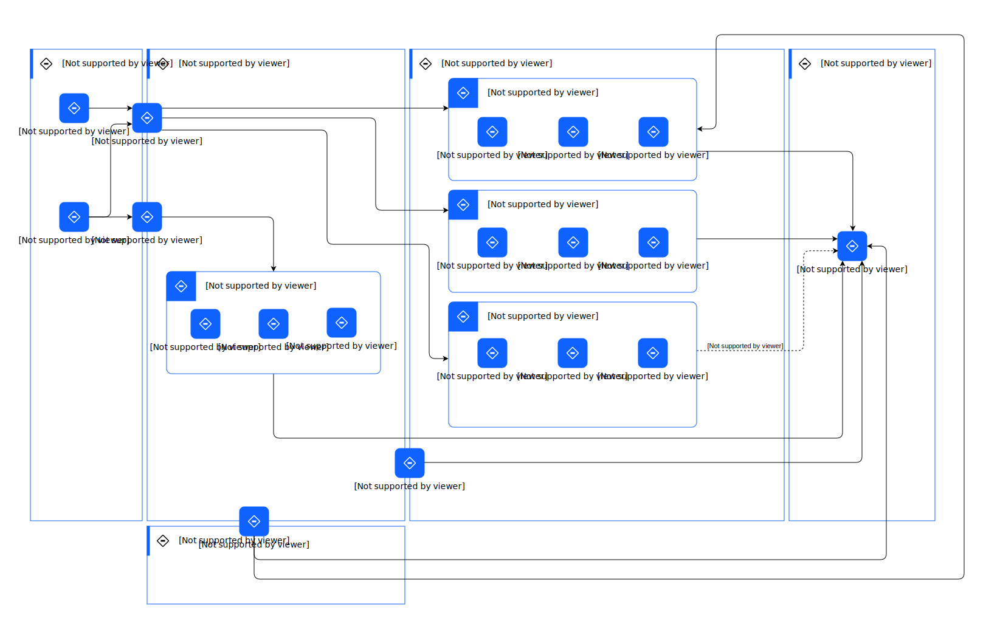

---
tags:
    - AOD-ITS
---

#  Deployment Overview - Current State

## Element(s)

### Location(s)

| Name | Description |
| --- | --- | 
 | AWS |  |
 | Client Network |  |
 | Hybrid Cloud | This refers to the various hyperscalers and on-prem. |
 | IBM Cloud |  |
 | IBM z16 |  |

### Logical Connection(s)

| Name | Description |
| --- | --- | 
|[future state] |  |

Other connections are not named.

    

### Logical Node(s)

    

Asset Management

<table>
    <caption></caption>
    <tr>
        <td> <strong>Name</strong> </td>
        <td>Asset Management</td>
    </tr>
    
    <tr>
        <td> <strong>Description</strong> </td>
        <td>The asset management layer allows customers to enable sustainability centric planning, operation, and management of their complex physical assets.</td>
    </tr>
    
    
    
    
    <tr>
        <td> <strong>Implementation</strong> </td>
        <td>
            
                
<a href="">Maximo Application Suite</a>

            
                
<a href="">Maximo Application Suite - Managed Services</a>

            
        </td>
    </tr>
    
    
    
    
    
    <tr>
        <td> <strong>Related Diagrams</strong> </td>
        <td>
            
                
<a href="../../../../Architecture/Architecture-Overview/Usage-Scenario/Managing-an-Asset">Managing an Asset</a>

            
                
<a href="../../../../Architecture/Architecture-Overview/IT-System-View/Deployment-Overview---Current-State">Deployment Overview - Current State</a>

            
        </td>
    </tr>
    
    
        <tr>
        <td> <strong>Related Elements</strong> </td>
        <td>
            
            
                
SYS_DU_3Us60cMrtoE

                
            
                
SYS_DU_3Urmyhd3Sdr

                
            
       </td>
       </tr>
    
    
</table>

    

Circular Economy & Reverse Logistics

<table>
    <caption></caption>
    <tr>
        <td> <strong>Name</strong> </td>
        <td>Circular Economy & Reverse Logistics</td>
    </tr>
    
    <tr>
        <td> <strong>Description</strong> </td>
        <td>Circular economy is an economic model in which resources are conserved and waste is minimized through the reuse and recycling of materials and products. Reverse logistics is a set of processes and activities related to the management of the return or reuse of products, materials, and resources.</td>
    </tr>
    
    
    
    <tr>
        <td> <strong>Primary Capability</strong> </td>
        <td>
            
                
application

            
        </td>
    </tr>
    
    
    <tr>
        <td> <strong>Implementation</strong> </td>
        <td>
            
                
<a href="https://www.ibm.com/products/supply-chain-intelligence-suite">Supply Chain Intelligence Suite</a>

            
        </td>
    </tr>
    
    
    
    
    
    <tr>
        <td> <strong>Related Diagrams</strong> </td>
        <td>
            
                
<a href="../../../../Architecture/Architecture-Overview/Usage-Scenario/Managing-an-Asset">Managing an Asset</a>

            
                
<a href="../../../../Architecture/Architecture-Overview/IT-System-View/Deployment-Overview---Current-State">Deployment Overview - Current State</a>

            
        </td>
    </tr>
    
    
        <tr>
        <td> <strong>Related Elements</strong> </td>
        <td>
            
            
                
SYS_DU_3UFIVr2nbGa

                
            
       </td>
       </tr>
    
    
</table>

    

Climate Risk

<table>
    <caption></caption>
    <tr>
        <td> <strong>Name</strong> </td>
        <td>Climate Risk</td>
    </tr>
    
    <tr>
        <td> <strong>Description</strong> </td>
        <td>The climate risk layer allows customers to identify, track, manage and mitigate climate-based risks [for example - temperature, humidity, precipitation, frost etc.]</td>
    </tr>
    
    
    
    
    <tr>
        <td> <strong>Implementation</strong> </td>
        <td>
            
                
<a href="https://www.ibm.com/products/environmental-intelligence-suite">Environmental Intelligence Suite (EIS)</a>

            
        </td>
    </tr>
    
    
    
    
    
    <tr>
        <td> <strong>Related Diagrams</strong> </td>
        <td>
            
                
<a href="../../../../Architecture/Architecture-Overview/Usage-Scenario/Managing-an-Asset">Managing an Asset</a>

            
                
<a href="../../../../Architecture/Architecture-Overview/IT-System-View/Deployment-Overview---Current-State">Deployment Overview - Current State</a>

            
        </td>
    </tr>
    
    
        <tr>
        <td> <strong>Related Elements</strong> </td>
        <td>
            
            
                
SYS_DU_3UrYxldevRj

                
            
       </td>
       </tr>
    
    
</table>

    

Climate Risk Map

<table>
    <caption></caption>
    <tr>
        <td> <strong>Name</strong> </td>
        <td>Climate Risk Map</td>
    </tr>
    
    <tr>
        <td> <strong>Description</strong> </td>
        <td>A climate risk map is a visual representation of the potential risks and impacts of climate change on a particular region or area.</td>
    </tr>
    
    
    
    
    <tr>
        <td> <strong>Implementation</strong> </td>
        <td>
            
                
<a href="https://www.ibm.com/products/environmental-intelligence-suite">Environmental Intelligence Suite (EIS)</a>

            
        </td>
    </tr>
    
    
    
    
    
    <tr>
        <td> <strong>Related Diagrams</strong> </td>
        <td>
            
                
<a href="../../../../Architecture/Architecture-Overview/Usage-Scenario/Managing-an-Asset">Managing an Asset</a>

            
                
<a href="../../../../Architecture/Architecture-Overview/IT-System-View/Deployment-Overview---Current-State">Deployment Overview - Current State</a>

            
        </td>
    </tr>
    
    
        <tr>
        <td> <strong>Related Elements</strong> </td>
        <td>
            
            
                
SYS_DU_3V1cMBYI8HD

                
            
       </td>
       </tr>
    
    
</table>

    

Efficiency Finder

<table>
    <caption></caption>
    <tr>
        <td> <strong>Name</strong> </td>
        <td>Efficiency Finder</td>
    </tr>
    
    <tr>
        <td> <strong>Description</strong> </td>
        <td>Application to identify and analyze the efficiency of assets within an asset management system. This may include identifying opportunities for improving the performance or efficiency of the asset, as well as identifying potential problems or inefficiencies that could impact its performance.</td>
    </tr>
    
    
    
    <tr>
        <td> <strong>Primary Capability</strong> </td>
        <td>
            
                
analytic & ai

            
        </td>
    </tr>
    
    
    <tr>
        <td> <strong>Implementation</strong> </td>
        <td>
            
                
<a href="https://www.ibm.com/products/maximo/remote-monitoring">Maximo Application Suite - Monitor</a>

            
                
<a href="">Maximo Application Suite</a>

            
        </td>
    </tr>
    
    
    
    
    
    <tr>
        <td> <strong>Related Diagrams</strong> </td>
        <td>
            
                
<a href="../../../../Architecture/Architecture-Overview/Usage-Scenario/Managing-an-Asset">Managing an Asset</a>

            
                
<a href="../../../../Architecture/Architecture-Overview/IT-System-View/Deployment-Overview---Current-State">Deployment Overview - Current State</a>

            
        </td>
    </tr>
    
    
        <tr>
        <td> <strong>Related Elements</strong> </td>
        <td>
            
            
                
SYS_DU_3UFuCBavm0g

                
            
                
SYS_DU_3UFudfr6WYr

                
            
       </td>
       </tr>
    
    
</table>

    

Environmental Data

<table>
    <caption></caption>
    <tr>
        <td> <strong>Name</strong> </td>
        <td>Environmental Data</td>
    </tr>
    
    <tr>
        <td> <strong>Description</strong> </td>
        <td> Environmental data refers to information that is collected about the natural environment and its various components, such as air, water, soil, plants, etc. This data can be collected using various methods, including field observations, remote sensing, and laboratory analysis, and it can be used to understand and monitor the health and functioning of the environment.</td>
    </tr>
    
    
    
    <tr>
        <td> <strong>Primary Capability</strong> </td>
        <td>
            
                
data

            
        </td>
    </tr>
    
    
    <tr>
        <td> <strong>Implementation</strong> </td>
        <td>
            
                
<a href="https://www.ibm.com/products/environmental-intelligence-suite">Environmental Intelligence Suite (EIS)</a>

            
        </td>
    </tr>
    
    
    
    
    
    <tr>
        <td> <strong>Related Diagrams</strong> </td>
        <td>
            
                
<a href="../../../../Architecture/Architecture-Overview/Usage-Scenario/Managing-an-Asset">Managing an Asset</a>

            
                
<a href="../../../../Architecture/Architecture-Overview/IT-System-View/Deployment-Overview---Current-State">Deployment Overview - Current State</a>

            
        </td>
    </tr>
    
    
        <tr>
        <td> <strong>Related Elements</strong> </td>
        <td>
            
            
                
SYS_DU_3UEmhwccFqh

                
            
       </td>
       </tr>
    
    
</table>

    

ERP

<table>
    <caption></caption>
    <tr>
        <td> <strong>Name</strong> </td>
        <td>ERP</td>
    </tr>
    
    <tr>
        <td> <strong>Description</strong> </td>
        <td>data from erp will push to asset mgmt, facilities, and supply chain</td>
    </tr>
    
    
    
    <tr>
        <td> <strong>Primary Capability</strong> </td>
        <td>
            
                
enterprise

            
        </td>
    </tr>
    
    
    
    
    
    
    <tr>
        <td> <strong>Related Diagrams</strong> </td>
        <td>
            
                
<a href="../../../../Architecture/Architecture-Overview/Usage-Scenario/Managing-an-Asset">Managing an Asset</a>

            
                
<a href="../../../../Architecture/Architecture-Overview/IT-System-View/Deployment-Overview---Current-State">Deployment Overview - Current State</a>

            
        </td>
    </tr>
    
    
    
</table>

    

ESG Reporting

<table>
    <caption></caption>
    <tr>
        <td> <strong>Name</strong> </td>
        <td>ESG Reporting</td>
    </tr>
    
    <tr>
        <td> <strong>Description</strong> </td>
        <td>The ESG platform layer allows customers to get deep visibility into environmental, human, and governance risks. </td>
    </tr>
    
    
    
    <tr>
        <td> <strong>Primary Capability</strong> </td>
        <td>
            
                
application

            
        </td>
    </tr>
    
    
    <tr>
        <td> <strong>Implementation</strong> </td>
        <td>
            
                
<a href="">enVizi (SaaS)</a>

            
        </td>
    </tr>
    
    
    
    
    
    <tr>
        <td> <strong>Related Diagrams</strong> </td>
        <td>
            
                
<a href="../../../../Architecture/Architecture-Overview/Usage-Scenario/Managing-an-Asset">Managing an Asset</a>

            
                
<a href="../../../../Architecture/Architecture-Overview/IT-System-View/Deployment-Overview---Current-State">Deployment Overview - Current State</a>

            
        </td>
    </tr>
    
    
        <tr>
        <td> <strong>Related Elements</strong> </td>
        <td>
            
            
                
SYS_DU_3Urk2rrz8Dq

                
            
       </td>
       </tr>
    
    
</table>

    

Facilities Management

<table>
    <caption></caption>
    <tr>
        <td> <strong>Name</strong> </td>
        <td>Facilities Management</td>
    </tr>
    
    <tr>
        <td> <strong>Description</strong> </td>
        <td>The facility management layer allows customers to enable sustainability-centric facilities management through various facility life cycle [acquire, build, manage, utilize, maintain and dispose of].</td>
    </tr>
    
    
    
    
    <tr>
        <td> <strong>Implementation</strong> </td>
        <td>
            
                
<a href="https://www.ibm.com/products/tririga">TRIRIGA application suite</a>

            
                
<a href="">TRIRIGA Application Suite - Managed Services</a>

            
        </td>
    </tr>
    
    
    
    
    
    <tr>
        <td> <strong>Related Diagrams</strong> </td>
        <td>
            
                
<a href="../../../../Architecture/Architecture-Overview/Usage-Scenario/Managing-an-Asset">Managing an Asset</a>

            
                
<a href="../../../../Architecture/Architecture-Overview/IT-System-View/Deployment-Overview---Current-State">Deployment Overview - Current State</a>

            
        </td>
    </tr>
    
    
        <tr>
        <td> <strong>Related Elements</strong> </td>
        <td>
            
            
                
SYS_DU_3Us6awsw6St

                
            
                
SYS_DU_3Urnfxmj8fW

                
            
       </td>
       </tr>
    
    
</table>

    

Geospatial Analytics

<table>
    <caption></caption>
    <tr>
        <td> <strong>Name</strong> </td>
        <td>Geospatial Analytics</td>
    </tr>
    
    <tr>
        <td> <strong>Description</strong> </td>
        <td>Geospatial analytics is the analysis of spatial data to understand and visualize patterns, trends, and relationships in a geographic context.</td>
    </tr>
    
    
    
    <tr>
        <td> <strong>Primary Capability</strong> </td>
        <td>
            
                
analytic & ai

            
        </td>
    </tr>
    
    
    <tr>
        <td> <strong>Implementation</strong> </td>
        <td>
            
                
<a href="https://www.ibm.com/products/environmental-intelligence-suite">Environmental Intelligence Suite (EIS)</a>

            
        </td>
    </tr>
    
    
    
    
    
    <tr>
        <td> <strong>Related Diagrams</strong> </td>
        <td>
            
                
<a href="../../../../Architecture/Architecture-Overview/Usage-Scenario/Managing-an-Asset">Managing an Asset</a>

            
                
<a href="../../../../Architecture/Architecture-Overview/IT-System-View/Deployment-Overview---Current-State">Deployment Overview - Current State</a>

            
        </td>
    </tr>
    
    
        <tr>
        <td> <strong>Related Elements</strong> </td>
        <td>
            
            
                
SYS_DU_3UEnmJL8q2U

                
            
       </td>
       </tr>
    
    
</table>

    

Green Leases

<table>
    <caption></caption>
    <tr>
        <td> <strong>Name</strong> </td>
        <td>Green Leases</td>
    </tr>
    
    <tr>
        <td> <strong>Description</strong> </td>
        <td>Green leases are leases for commercial or residential properties that include provisions related to environmental sustainability and energy efficiency. These provisions may require the tenant or property owner to take certain actions to reduce their environmental impact, such as using energy-efficient appliances or implementing water conservation measures.</td>
    </tr>
    
    
    
    <tr>
        <td> <strong>Primary Capability</strong> </td>
        <td>
            
                
application

            
        </td>
    </tr>
    
    
    <tr>
        <td> <strong>Implementation</strong> </td>
        <td>
            
                
<a href="https://www.ibm.com/products/tririga">TRIRIGA application suite</a>

            
                
<a href="">TRIRIGA Application Suite - Managed Services</a>

            
                
<a href="https://www.ibm.com/products/tririga">TRIRIGA Application Suite - Lease</a>

            
        </td>
    </tr>
    
    
    
    
    
    <tr>
        <td> <strong>Related Diagrams</strong> </td>
        <td>
            
                
<a href="../../../../Architecture/Architecture-Overview/Usage-Scenario/Managing-an-Asset">Managing an Asset</a>

            
                
<a href="../../../../Architecture/Architecture-Overview/IT-System-View/Deployment-Overview---Current-State">Deployment Overview - Current State</a>

            
        </td>
    </tr>
    
    
        <tr>
        <td> <strong>Related Elements</strong> </td>
        <td>
            
            
                
SYS_DU_3UFvCZPZsBL

                
            
                
SYS_DU_3UFyVnub9pI

                
            
                
SYS_DU_3UFyVnnuNt3

                
            
       </td>
       </tr>
    
    
</table>

    

Integration and Connectivity Services

<table>
    <caption></caption>
    <tr>
        <td> <strong>Name</strong> </td>
        <td>Integration and Connectivity Services</td>
    </tr>
    
    <tr>
        <td> <strong>Description</strong> </td>
        <td>The integration services consumes information from the physical and ERP systems and will provide the interface to data and/or functionality of one or more sustainability applications.. This includes:
<ul><li>REST API</li><li>Connector</li><li>Web Forms</li><li>Edge</li><li>External Events</li><li>Financials</li><li>Locations</li></ul>
For more information, refer to the Sustainability Overview Reference Architecture.

</td>
    </tr>
    
    
    
    <tr>
        <td> <strong>Primary Capability</strong> </td>
        <td>
            
                
integration

            
        </td>
    </tr>
    
    
    
    
    
    
    <tr>
        <td> <strong>Related Diagrams</strong> </td>
        <td>
            
                
<a href="../../../../Architecture/Architecture-Overview/Usage-Scenario/Managing-an-Asset">Managing an Asset</a>

            
                
<a href="../../../../Architecture/Architecture-Overview/IT-System-View/Deployment-Overview---Current-State">Deployment Overview - Current State</a>

            
        </td>
    </tr>
    
    
    
</table>

    

Intelligent Maintenance

<table>
    <caption></caption>
    <tr>
        <td> <strong>Name</strong> </td>
        <td>Intelligent Maintenance</td>
    </tr>
    
    <tr>
        <td> <strong>Description</strong> </td>
        <td>Application for managing and maintaining assets that use data and analytics to predict when maintenance is needed. This approach is designed to optimize the maintenance schedule for an asset based on its actual condition, rather than following a predetermined schedule or reacting to failures.</td>
    </tr>
    
    
    
    <tr>
        <td> <strong>Primary Capability</strong> </td>
        <td>
            
                
ai

            
        </td>
    </tr>
    
    
    <tr>
        <td> <strong>Implementation</strong> </td>
        <td>
            
                
<a href="">Maximo Application Suite - Managed Services</a>

            
        </td>
    </tr>
    
    
    
    
    
    <tr>
        <td> <strong>Related Diagrams</strong> </td>
        <td>
            
                
<a href="../../../../Architecture/Architecture-Overview/Usage-Scenario/Managing-an-Asset">Managing an Asset</a>

            
                
<a href="../../../../Architecture/Architecture-Overview/IT-System-View/Deployment-Overview---Current-State">Deployment Overview - Current State</a>

            
        </td>
    </tr>
    
    
        <tr>
        <td> <strong>Related Elements</strong> </td>
        <td>
            
            
                
SYS_DU_3Uyn24bnLaj

                
            
       </td>
       </tr>
    
    
</table>

    

IT Optimization Services

<table>
    <caption></caption>
    <tr>
        <td> <strong>Name</strong> </td>
        <td>IT Optimization Services</td>
    </tr>
    
    <tr>
        <td> <strong>Description</strong> </td>
        <td>Maximize the efficiency and sustainability of an organization's I.T. infrastructure and operations.</td>
    </tr>
    
    
    
    <tr>
        <td> <strong>Primary Capability</strong> </td>
        <td>
            
                
management

            
        </td>
    </tr>
    
    
    <tr>
        <td> <strong>Implementation</strong> </td>
        <td>
            
                
<a href="https://www.ibm.com/products/turbonomic">Turbonomic</a>

            
        </td>
    </tr>
    
    
    
    
    
    <tr>
        <td> <strong>Related Diagrams</strong> </td>
        <td>
            
                
<a href="../../../../Architecture/Architecture-Overview/Usage-Scenario/Managing-an-Asset">Managing an Asset</a>

            
                
<a href="../../../../Architecture/Architecture-Overview/IT-System-View/Deployment-Overview---Current-State">Deployment Overview - Current State</a>

            
        </td>
    </tr>
    
    
        <tr>
        <td> <strong>Related Elements</strong> </td>
        <td>
            
            
                
SYS_DU_3V1drmkqNPX

                
            
       </td>
       </tr>
    
    
</table>

    

Physical Systems

<table>
    <caption></caption>
    <tr>
        <td> <strong>Name</strong> </td>
        <td>Physical Systems</td>
    </tr>
    
    <tr>
        <td> <strong>Description</strong> </td>
        <td>The physical system is where the following data gets generated and stored. This includes:
<ul><li>Sensors</li><li>IoT</li><li>Metering System</li><li>Controls</li><li>Asset</li><li>Lease System</li><li>Network Equipment</li><li>Spreadsheets</li></ul>
For more information, refer to the Enterprise view: Sustainability Overview Reference Architecture.

</td>
    </tr>
    
    
    
    <tr>
        <td> <strong>Primary Capability</strong> </td>
        <td>
            
                
not specified

            
        </td>
    </tr>
    
    
    
    
    
    
    <tr>
        <td> <strong>Related Diagrams</strong> </td>
        <td>
            
                
<a href="../../../../Architecture/Architecture-Overview/Usage-Scenario/Managing-an-Asset">Managing an Asset</a>

            
                
<a href="../../../../Architecture/Architecture-Overview/IT-System-View/Deployment-Overview---Current-State">Deployment Overview - Current State</a>

            
        </td>
    </tr>
    
    
    
</table>

    

Scope 3 GHG Reporting & Performance

<table>
    <caption></caption>
    <tr>
        <td> <strong>Name</strong> </td>
        <td>Scope 3 GHG Reporting & Performance</td>
    </tr>
    
    <tr>
        <td> <strong>Description</strong> </td>
        <td>Scope 3 GHG (greenhouse gas) reporting and performance refers to the measurement, reporting, and management of greenhouse gas emissions from sources that are not directly owned or controlled by an organization, but that are related to its activities.</td>
    </tr>
    
    
    
    <tr>
        <td> <strong>Primary Capability</strong> </td>
        <td>
            
                
application

            
        </td>
    </tr>
    
    
    <tr>
        <td> <strong>Implementation</strong> </td>
        <td>
            
                
<a href="https://www.ibm.com/products/supply-chain-intelligence-suite">Supply Chain Intelligence Suite</a>

            
        </td>
    </tr>
    
    
    
    
    
    <tr>
        <td> <strong>Related Diagrams</strong> </td>
        <td>
            
                
<a href="../../../../Architecture/Architecture-Overview/Usage-Scenario/Managing-an-Asset">Managing an Asset</a>

            
                
<a href="../../../../Architecture/Architecture-Overview/IT-System-View/Deployment-Overview---Current-State">Deployment Overview - Current State</a>

            
        </td>
    </tr>
    
    
        <tr>
        <td> <strong>Related Elements</strong> </td>
        <td>
            
            
                
SYS_DU_3UFJ1olt0kk

                
            
       </td>
       </tr>
    
    
</table>

    

Supply Chain Circularity

<table>
    <caption></caption>
    <tr>
        <td> <strong>Name</strong> </td>
        <td>Supply Chain Circularity</td>
    </tr>
    
    <tr>
        <td> <strong>Description</strong> </td>
        <td>The Supply Chain Circularity Layer allows customers to minimize the costs and amount of carbon emissions generated by supply chain activities</td>
    </tr>
    
    
    
    
    <tr>
        <td> <strong>Implementation</strong> </td>
        <td>
            
                
<a href="">Supply Chain Intelligence Suite (SaaS)</a>

            
        </td>
    </tr>
    
    
    
    
    
    <tr>
        <td> <strong>Related Diagrams</strong> </td>
        <td>
            
                
<a href="../../../../Architecture/Architecture-Overview/Usage-Scenario/Managing-an-Asset">Managing an Asset</a>

            
                
<a href="../../../../Architecture/Architecture-Overview/IT-System-View/Deployment-Overview---Current-State">Deployment Overview - Current State</a>

            
        </td>
    </tr>
    
    
        <tr>
        <td> <strong>Related Elements</strong> </td>
        <td>
            
            
                
SYS_DU_3UrYNkGsAs7

                
            
       </td>
       </tr>
    
    
</table>

    

Sustainability Computing

<table>
    <caption></caption>
    <tr>
        <td> <strong>Name</strong> </td>
        <td>Sustainability Computing</td>
    </tr>
    
    <tr>
        <td> <strong>Description</strong> </td>
        <td>Designing and implementing computer systems and applications that are environmentally sustainable and minimize their impact on the planet.</td>
    </tr>
    
    
    
    
    
    
    
    
    <tr>
        <td> <strong>Related Diagrams</strong> </td>
        <td>
            
                
<a href="../../../../Architecture/Architecture-Overview/Usage-Scenario/Managing-an-Asset">Managing an Asset</a>

            
                
<a href="../../../../Architecture/Architecture-Overview/IT-System-View/Deployment-Overview---Current-State">Deployment Overview - Current State</a>

            
        </td>
    </tr>
    
    
    
</table>

    

Sustainable Health

<table>
    <caption></caption>
    <tr>
        <td> <strong>Name</strong> </td>
        <td>Sustainable Health</td>
    </tr>
    
    <tr>
        <td> <strong>Description</strong> </td>
        <td>It is the ability of an asset to operate effectively and efficiently over a long period of time without incurring excessive costs or causing negative impacts on the environment.</td>
    </tr>
    
    
    
    <tr>
        <td> <strong>Primary Capability</strong> </td>
        <td>
            
                
analytic & ai

            
        </td>
    </tr>
    
    
    <tr>
        <td> <strong>Implementation</strong> </td>
        <td>
            
                
<a href="">Maximo Application Suite</a>

            
                
<a href="">Maximo Application Suite - Managed Services</a>

            
                
<a href="https://www.ibm.com/products/maximo/predictive-maintenance">Maximo Application Suite - Health</a>

            
        </td>
    </tr>
    
    
    
    
    
    <tr>
        <td> <strong>Related Diagrams</strong> </td>
        <td>
            
                
<a href="../../../../Architecture/Architecture-Overview/Usage-Scenario/Managing-an-Asset">Managing an Asset</a>

            
                
<a href="../../../../Architecture/Architecture-Overview/IT-System-View/Deployment-Overview---Current-State">Deployment Overview - Current State</a>

            
        </td>
    </tr>
    
    
        <tr>
        <td> <strong>Related Elements</strong> </td>
        <td>
            
            
                
SYS_DU_3UFv1WIRLPn

                
            
                
SYS_DU_3UFv1WFAz30

                
            
                
SYS_DU_3UFv1WzhEIT

                
            
       </td>
       </tr>
    
    
</table>

    

Sustainable Projects

<table>
    <caption></caption>
    <tr>
        <td> <strong>Name</strong> </td>
        <td>Sustainable Projects</td>
    </tr>
    
    <tr>
        <td> <strong>Description</strong> </td>
        <td>Sustainable projects aim to reduce environmental impacts, such as greenhouse gas emissions or resource consumption, or improve social and economic conditions by creating jobs or improving quality of life.</td>
    </tr>
    
    
    
    <tr>
        <td> <strong>Primary Capability</strong> </td>
        <td>
            
                
application

            
        </td>
    </tr>
    
    
    <tr>
        <td> <strong>Implementation</strong> </td>
        <td>
            
                
<a href="https://www.ibm.com/products/tririga">TRIRIGA application suite</a>

            
                
<a href="https://www.ibm.com/products/tririga/capital-projects">TRIRIGA Application Suite - Projects</a>

            
        </td>
    </tr>
    
    
    
    
    
    <tr>
        <td> <strong>Related Diagrams</strong> </td>
        <td>
            
                
<a href="../../../../Architecture/Architecture-Overview/Usage-Scenario/Managing-an-Asset">Managing an Asset</a>

            
                
<a href="../../../../Architecture/Architecture-Overview/IT-System-View/Deployment-Overview---Current-State">Deployment Overview - Current State</a>

            
        </td>
    </tr>
    
    
        <tr>
        <td> <strong>Related Elements</strong> </td>
        <td>
            
            
                
SYS_DU_3UFzgDs6Qi1

                
            
                
SYS_DU_3UFzgDlvGhe

                
            
       </td>
       </tr>
    
    
</table>

    

Sustainable Sourcing & Procurement

<table>
    <caption></caption>
    <tr>
        <td> <strong>Name</strong> </td>
        <td>Sustainable Sourcing & Procurement</td>
    </tr>
    
    <tr>
        <td> <strong>Description</strong> </td>
        <td>Sustainable sourcing and procurement refers to the processes and practices used to acquire goods and services in a way that is environmentally, socially, and economically responsible and sustainable over the long term.</td>
    </tr>
    
    
    
    <tr>
        <td> <strong>Primary Capability</strong> </td>
        <td>
            
                
application

            
        </td>
    </tr>
    
    
    <tr>
        <td> <strong>Implementation</strong> </td>
        <td>
            
                
<a href="https://www.ibm.com/products/supply-chain-intelligence-suite">Supply Chain Intelligence Suite</a>

            
        </td>
    </tr>
    
    
    
    
    
    <tr>
        <td> <strong>Related Diagrams</strong> </td>
        <td>
            
                
<a href="../../../../Architecture/Architecture-Overview/Usage-Scenario/Managing-an-Asset">Managing an Asset</a>

            
                
<a href="../../../../Architecture/Architecture-Overview/IT-System-View/Deployment-Overview---Current-State">Deployment Overview - Current State</a>

            
        </td>
    </tr>
    
    
        <tr>
        <td> <strong>Related Elements</strong> </td>
        <td>
            
            
                
SYS_DU_3UFFDisb7Nw

                
            
       </td>
       </tr>
    
    
</table>

    

Sustainable Space

<table>
    <caption></caption>
    <tr>
        <td> <strong>Name</strong> </td>
        <td>Sustainable Space</td>
    </tr>
    
    <tr>
        <td> <strong>Description</strong> </td>
        <td>Sustainable space refers to physical spaces, such as buildings, neighborhoods, or communities, that are designed and operated in a way that is environmentally, socially, and economically responsible and sustainable over the long term.</td>
    </tr>
    
    
    
    <tr>
        <td> <strong>Primary Capability</strong> </td>
        <td>
            
                
application

            
        </td>
    </tr>
    
    
    <tr>
        <td> <strong>Implementation</strong> </td>
        <td>
            
                
<a href="https://www.ibm.com/products/tririga">TRIRIGA application suite</a>

            
                
<a href="https://www.ibm.com/products/tririga/capital-projects">TRIRIGA Application Suite - Projects</a>

            
        </td>
    </tr>
    
    
    
    
    
    <tr>
        <td> <strong>Related Diagrams</strong> </td>
        <td>
            
                
<a href="../../../../Architecture/Architecture-Overview/Usage-Scenario/Managing-an-Asset">Managing an Asset</a>

            
                
<a href="../../../../Architecture/Architecture-Overview/IT-System-View/Deployment-Overview---Current-State">Deployment Overview - Current State</a>

            
        </td>
    </tr>
    
    
        <tr>
        <td> <strong>Related Elements</strong> </td>
        <td>
            
            
                
SYS_DU_3UFB1dtuuaO

                
            
                
SYS_DU_3UFB1dmrJbx

                
            
       </td>
       </tr>
    
    
</table>

    

