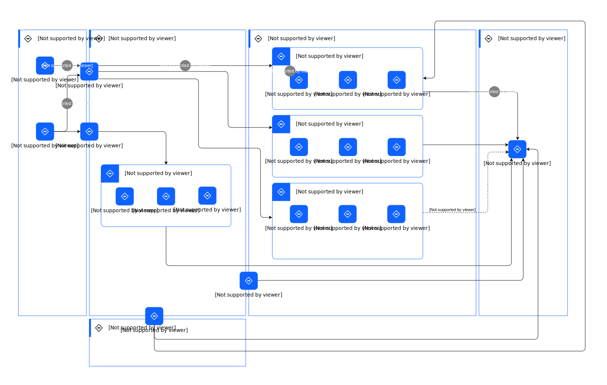

---
tags:
    - AOD-Usage
---

#  Managing an Asset

## Step List

| Name | Description |
| --- | --- | 
 | 1 | The integration allows seamless data transfer from physical and ERP systems within the client network to enterprise sustainability&nbsp;applications in hybrid cloud. |
 | 2 | The data from physical and ERP systems are stored, analyzed, and consumed to achieve the ESG goals of an organization, thereby&nbsp;improving its environmental sustainability performance.&nbsp; |
 | 3 | Intelligent maintenance application consumes the asset data to identify operational issues, improve maintenance and reduce&nbsp;environmental impact.&nbsp; |
 | 4 | The information from asset management applications will be consumed by the ESG reporting engine for goal setting and tracking&nbsp;the ESG goals.&nbsp; |

    

