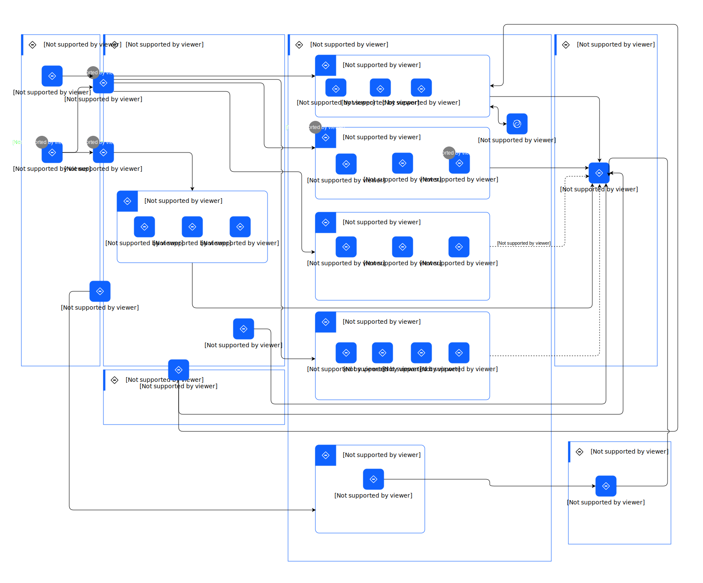

---
tags:
    - AOD-Usage
---

#  Monitoring an Asset

### Description

Monitoring an asset enables real-time tracking of asset health, performance, and condition, allowing for proactive maintenance and swift issue resolution to ensure optimal operation and longevity.

## Step List

| Name | Description |
| --- | --- | 
 | 1 | 
The integration allows seamless data transfer from physical and ERP systems within the client network to enterprise sustainability applications in hybrid cloud.
 |
 | 2 | 
The data from physical and ERP systems are stored, analyzed, and consumed to achieve the ESG goals of an organization, thereby improving its environmental sustainability performance.
 |
 | 3 | 
Intelligent maintenance application consumes the asset interval data to identify operational issues, improve maintenance and reduce environmental impact.
 |
 | 4 | 
The information from asset management applications will be consumed by the ESG reporting engine for goal setting and tracking the ESG goals.
 |

    

