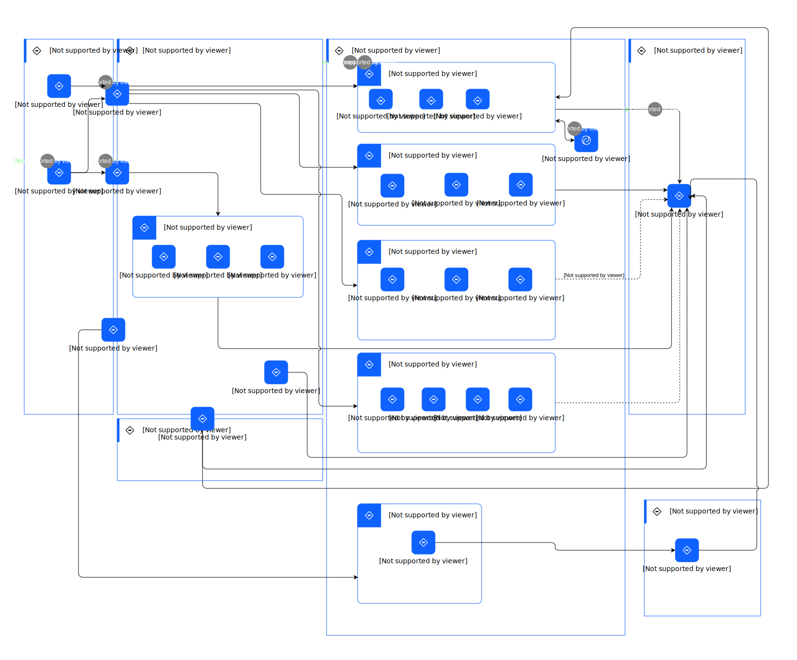

---
tags:
    - AOD-Usage
---

#  Optimize an Asset with AI

### Description

Optimizing an asset with AI enhances asset management by automating the classification of work orders, predicting failures, and recommending maintenance actions, leading to more efficient operations and reduced manual intervention.

## Step List

| Name | Description |
| --- | --- | 
 | 1 | 
The integration allows seamless data transfer from physical and ERP systems within the client network to enterprise sustainability applications in hybrid cloud.
 |
 | 2 | 
The data from physical and ERP systems are stored, analyzed, and consumed to achieve the ESG goals of an organization, thereby improving its environmental sustainability performance.
 |
 | 3 | 
Intelligent maintenance application consumes the asset data to identify operational issues, improve maintenance and reduce environmental impact.
 |
 | 4 | 
Generative AI applications consume data, run through models, and provide intelligence to optimize assets.
 |
 | 5 | 
Intelligent maintenance application consumes the Gen AI data to optimize the operations.
 |
 | 6 | 
The information from asset management applications will be consumed by the ESG reporting engine for goal setting and tracking the ESG goals.
 |

    

