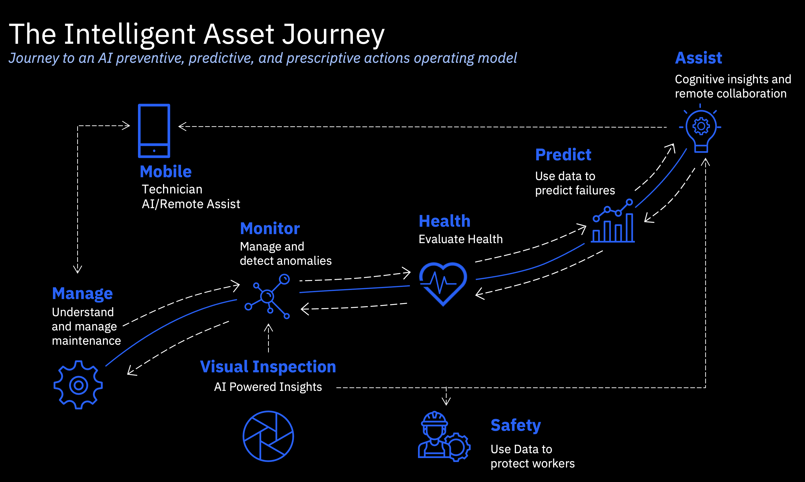

# Overview

 <b>Intelligent Asset Reference Architecture Project Definition</b> 
 

The Intelligent Asset Reference Architecture provides recommended structures and integrations as a single access point for a suite of asset lifecycle management capabilities. The suite allows users to sign on to a single, integrated platform to access key monitoring, maintenance, and reliability applications across the business. Not only does it help remove data silos, but it also enhances data sharing with integrated user experience and shared administrative controls for enterprise-scale execution. 
 
The Intelligent Asset Reference Architecture is a building block for complimentary solution architectures for applications as part of the suite. Key asset management capabilities within the suite include: managing, monitoring, evaluating health, predicting failures, and visual inspection, to name a few. Customers can start at any point in the asset lifecycle and expand into other areas.  A depiction of the intelligent asset journey is in the image below. 

 

 

 

This flexibility uses a simplified, suite-based licensing structure and does not require additional provisioning. Through Red Hat OpenShift and hybrid cloud deployment, provisioning the suite across multiple clouds, on-premises, or hosted as a managed service on IBM Cloud is achievable.

 

The <b>Intelligent Asset Reference Architecture </b>is core to the overall suite of applications.  Therefore, the current and future approach to documenting <b>Intelligent Asset </b>architectures is as follows: 

 

<ul><li><b>Intelligent Asset</b> Reference Architecture (core)</li><ul><li><b>Intelligent Asset Inspection </b>Architecture (Phase 1: Visual Inspection)</li><li><b>Intelligent Asset Insights </b>Architecture (Phase 2: Monitor, Health, Predict)</li><li><b>Intelligent Asset Mobile </b>Application<b> </b>Architecture (Phase 3:  Mobile)</li><li><b>Intelligent Asset Safety </b>Architecture (Phase 3: Safety)</li><li><b>Intelligent Asset Assistance</b> Architecture (Phase 3: Assist) </li></ul></ul>

 

In Phase 1 of this project, the <a href="https://pages.github.ibm.com/skol/hypersonic-intelligent-asset-inspection/" target="_blank">Intelligent Asset Inspection Technology Pattern</a> includes a complementary <a href="https://pages.github.ibm.com/solution-architectures/intelligent-asset-inspection/" target="_blank">Intelligent Asset Inspection solution architecture</a> as part of this Intelligent Asset Reference Architecture (core).  The purpose of a technology pattern is to codify existing design knowledge so that specialists and architects are not constantly reinventing the wheel. 

 

With Intelligent Assets, customers achieve sustainable asset management and reliability optimization.  They can enable the creation of resilient and sustainable infrastructure and operations to extend the life of equipment, buildings, bridges, fleets, water lines, and more to reach sustainability targets.   The most popular use cases for the suite include but are not limited to:    <ol><li><b>Asset Management & Maintenance: </b>Optimize maintenance schedules to achieve efficient, safe, and sustainable work practices.</li><li><b>Asset Reliability and Optimization:</b> Extending asset life decreases waste & embodied carbon and improves energy efficiency. </li><li><b>Asset Monitoring and Fault Detection: </b>Increased energy efficiency, equipment performance, and reliability.</li></ol>

 

If you have any questions or comments, contact René Bostic at <a href="https://w3.ibm.com/#/people/543034897" target="_blank">rbostic@us.ibm.com</a> or Balaji Santhanakrishnan at <a href="https://bsanthana@us.ibm.com" target="_blank">bsanthana@us.ibm.com</a>

 
  
