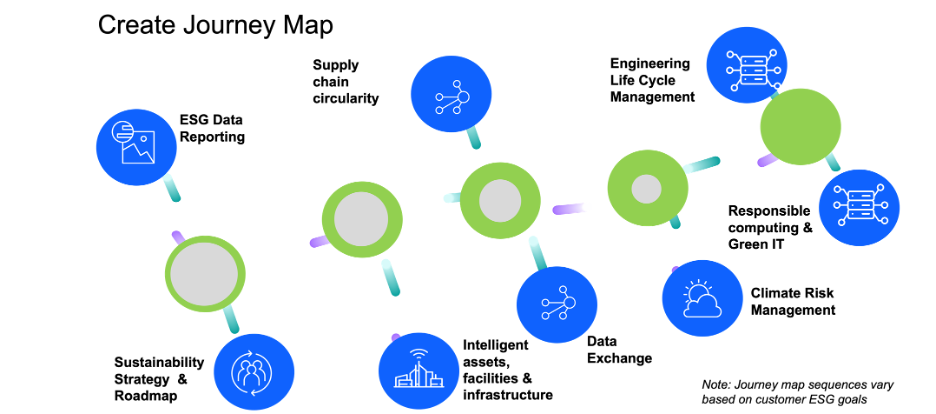

# Overview

<strong>Sustainability Reference Architecture</strong> The sustainability reference architecture diagram will illustrate how various software applications supporting different business segments can work together to assist customers in achieving their ESG (Environmental, Social, and Governance) goals. The diagram depicts the various data sources that capture sustainability information critical for producing corporate sustainability reports and how these data sources are collected, assembled, analyzed, and reported.  These processes are essential for ensuring an enterprise operates to support the organization's sustainability goals. Furthermore, the reference architecture highlights the importance of these data sources for not only tracking and reporting but also for operationalizing ESG goals through the implementation of corrective actions powered by artificial intelligence applications. The image below illustrates the journey of sustainability operations.   To achieve sustainable operations, companies need to embark on a journey that starts with a strategy and roadmap, with ESG data reporting being a critical aspect.

It all starts with developing a strategy and roadmap, and ESG data reporting is critical. IBM Consulting and business partners can help customers in this regard, while the Envizi application can assist with ESG reporting.

The journey will vary depending on the customer's current state, priorities, and goals. For example, the next step in the above journey map is intelligent asset and facility infrastructure, where IBM Maximo and TRIRIGA applications can help reduce scope 1 and 2 emissions.

The next step in the journey addresses data and scope 3 carbon emissions, which the IBM Supply chain intelligence suite application. Data Exchange can help organizations securely share and analyze sustainability-related data across ecosystems.

Climate risk mitigation may be the next logical step depending on the type of industry. Sustainable computing optimizing computing resources and energy usage to minimize environmental impact.

The final step is Engineering lifecycle management for streamlining development processes, reducing waste, and optimizing resource use throughout the product lifecycle.  No matter what options customers choose, IBM has a solution that can help them achieve their sustainability goals. You can refer to the following external links to learn about IBM's sustainability offerings in these areas.
<ol><li><a href="https://www.ibm.com/resources/sustainability/guidebook-build/">Sustainability Strategy and Roadmap</a></li><li><a href="https://www.ibm.com/resources/guides/intelligent-asset-management/">Intelligent assets & facilities infrastructure</a></li><li><a href="https://www.ibm.com/supply-chain">Sustainable supply chain & circularity</a></li><li><a href="https://www.ibm.com/sterling">Data Exchange</a></li><li><a href="https://www.ibm.com/resources/business-operations/manage-climate-risk">Climate Risk Management</a></li><li><a href="https://www.ibm.com/products/engineering-lifecycle-management">Engineering Lifecycle Management</a></li></ol>
Here, we are focused on Sustainability Architecture. For an overview of it, see section 5.1.2. It covers various systems within an enterprise essential for capturing, reporting, and operationalizing sustainability goals. We are developing a drilled-down version of the Sustainability Architecture, and you will find those in the following list. We will update these links to include additional architectures as and when it is available.
<ol><li>ESG Data Reporting Reference Architecture</li><li><a href="https://w3.ibm.com/tools/cogarch/architectures/Collaboration/arch_S1dSACWGn">Intelligent Asset Reference Architecture</a></li><li>Intelligent Facility Reference Architecture</li><li>Sustainable supply chain & circularity Reference Architecture</li><li>Data Exchange Reference Architecture</li><li>Climate Risk Management Reference Architecture</li><li>Engineering Lifecycle Management Reference Architecture</li></ol>
If you have any questions or comments, contact SSW-Architecture-Questions@ibm.com   

