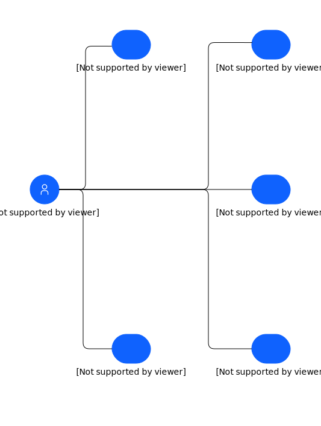

---
tags:
    - UCD
---

#  Business Use Cases

### Description

This shows the five key business use cases in Sustainability.

## Element(s)

### Actor(s)

| Name | Description | Type | GenericGroup |
| --- | --- | --- | --- |
 | Application Users | Application users refer to individuals with different roles and responsibilities within an enterprise, such as Sustainability Managers, Operations and Maintenance Managers, Supply Chain and Procurement Managers, Risk and Finance Managers, and IT and Sustainability Managers, who use an application for managing ESG reporting, assets and facilities, supply chain, climate risk, and IT sustainability infrastructure. | Human |  |

### Use Case(s)
| Name | Description |
| --- | --- |
| Asset Operation Optimization for Sustainability | To identify and implement sustainable practices and initiatives that reduce the negative impact of assets on the environment while improving efficiency and performance. | 
| Space Utilization Optimization for Sustainability | To analyze and optimize the usage of physical space in an organization to reduce waste, increase efficiency, and support sustainability goals. | 
| Climate Risk Management for Sustainability | Identify, assess, and manage climate-related risks to an organization's operations, assets, and stakeholders through effective risk management strategies. | 
| Supply Chain Optimization for Sustainability | Optimize supply chain operations to reduce environmental impact, increase efficiency, and promote sustainability in an organization's supply chain. | 
| Green IT for Sustainability | Implement sustainable and environmentally-friendly practices and technologies in an organization's I.T. infrastructure to reduce energy consumption, carbon footprint, and promote sustainability. | 

### Associations(s)

All associations are not named.

    

