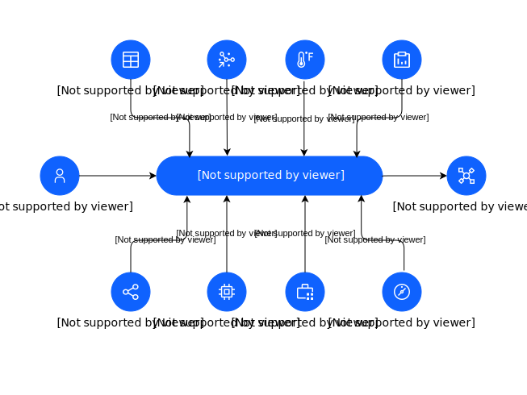

### Name

Sustainability System

## Element(s)

### Target System(s)

| Name | Description |
| --- | --- |
 | Sustainability System |  |

### Actor(s)

| Name | Description | Type | GenericGroup |
| --- | --- | --- | --- |
 | Application Users | Application users refer to individuals with different roles and responsibilities within an enterprise, such as Sustainability Managers, Operations and Maintenance Managers, Supply Chain and Procurement Managers, Risk and Finance Managers, and IT and Sustainability Managers, who use an application for managing ESG reporting, assets and facilities, supply chain, climate risk, and IT sustainability infrastructure. | Human |  |
 | Asset | Assets can include machinery, equipment, buildings, vehicles, and other infrastructure that are necessary for the operation of a business or organization. | IT System | 
<strong>SubSystem,Physical</strong>[Auto-Generated]

This group is derived from SubSystem named Physical.
 |
 | Controls | A control system uses sensors and actuators to monitor and control the operation of a system or process. Control systems can be used to automatically adjust the operation of a system based on predetermined setpoints, as well as to respond to changes in the environment or to commands from operators.  | IT System | 
<strong>SubSystem,Physical</strong>[Auto-Generated]

This group is derived from SubSystem named Physical.
 |
 | IoT | The Internet of Things (IoT) is a system of interconnected devices, machines, and systems communicating and exchanging data over a network without requiring human intervention. These devices may be connected through various technologies, including wireless, wired, and Bluetooth, and they can be used to gather and transmit data for various purposes, including energy management, building automation, and asset tracking.  | IT System | 
<strong>SubSystem,Physical</strong>[Auto-Generated]

This group is derived from SubSystem named Physical.
 |
 | Lease Information | A sensor is a device that provides a usable output in response to a specified physical input. Sensors are often used to detect and measure environmental parameters such as temperature, humidity, air quality, and occupancy. | IT System |  |
 | Metering System | The metering system is a system of meters that provides data on energy use, energy demand, or other performance characteristics of a building system, subsystem, or equipment. Building Management   | IT System | 
<strong>SubSystem,Physical</strong>[Auto-Generated]

This group is derived from SubSystem named Physical.
 |
 | Network equipment | A sensor is a device that provides a usable output in response to a specified physical input. Sensors are often used to detect and measure environmental parameters such as temperature, humidity, air quality, and occupancy. | IT System |  |
 | Reporting System | A reporting system provide users with the necessary information to make informed decisions and take action to improve the performance of the domain or function being monitored. | IT System |  |
 | Sensors | A sensor is a device that provides a usable output in response to a specified physical input. Sensors are often used to detect and measure environmental parameters such as temperature, humidity, air quality, and occupancy. | IT System | 
<strong>SubSystem,Physical</strong>[Auto-Generated]

This group is derived from SubSystem named Physical.
 |
 | Spreadsheet | A sensor is a device that provides a usable output in response to a specified physical input. Sensors are often used to detect and measure environmental parameters such as temperature, humidity, air quality, and occupancy. | IT System |  |

